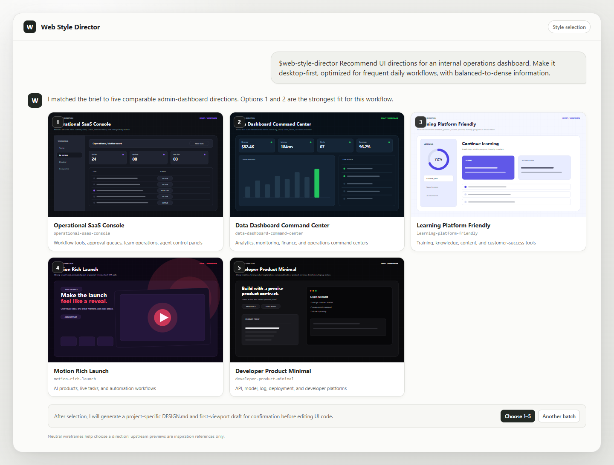

# AI UI Style Director

[简体中文](README.zh-CN.md)

AI UI Style Director is a UI-direction workflow for coding agents. Before a new website or redesign is implemented, it recommends five relevant visual directions. After you choose one, it generates a project-specific `DESIGN.md` and lets the agent start building from that contract.

Codex and Claude Code have first-class support on Windows, macOS, and Linux. Other Agent Skills-compatible tools are supported on a best-effort basis.

## Install

Send this to your coding agent:

```text
Read and follow:
https://raw.githubusercontent.com/coconilu/ai-ui-style-director/main/INSTALL.md

Install Web Style Director for the current agent and run its verification when finished.
```

Installation requires Git and Node.js 20 or newer.

## Use

Codex:

```text
$web-style-director I want to build an AI developer tool website
```

Claude Code:

```text
/web-style-director I want to build an AI developer tool website
```

The agent shows a brand-neutral SVG draft and upstream Light/Dark live-preview links for each of the five directions. After selection, it generates a project-specific `DESIGN.md` and first-viewport draft, then implements only after confirmation.

## Example: choose an admin dashboard direction

One prompt becomes five comparable directions before any UI code is written:



## Update

Codex:

```text
$web-style-director update
```

Claude Code:

```text
/web-style-director update
```

You can also say: `Update web-style-director and verify it afterward.`

## Uninstall

Codex:

```text
$web-style-director uninstall
```

Claude Code:

```text
/web-style-director uninstall
```

`delete` and “remove web-style-director” are also treated as uninstall intent. Uninstall removes only the tool; it does not delete project `DESIGN.md` files, `.ui-style-director/` state, or website code.

## Documentation

- [Workflow](docs/WORKFLOW.md)
- [Visual previews](docs/VISUAL_PREVIEWS.md)
- [Supported platforms](docs/PLATFORMS.md)
- [CLI reference](docs/CLI.md)
- [Providers and source boundaries](docs/PROVIDERS.md)
- [Architecture](docs/ARCHITECTURE.md)
- [Development and maintenance](docs/DEVELOPMENT.md)
- [Third-party notices](THIRD_PARTY_NOTICES.md)

MIT License. Follow upstream licenses and do not copy protected brand assets, proprietary copy, or exact page layouts.
