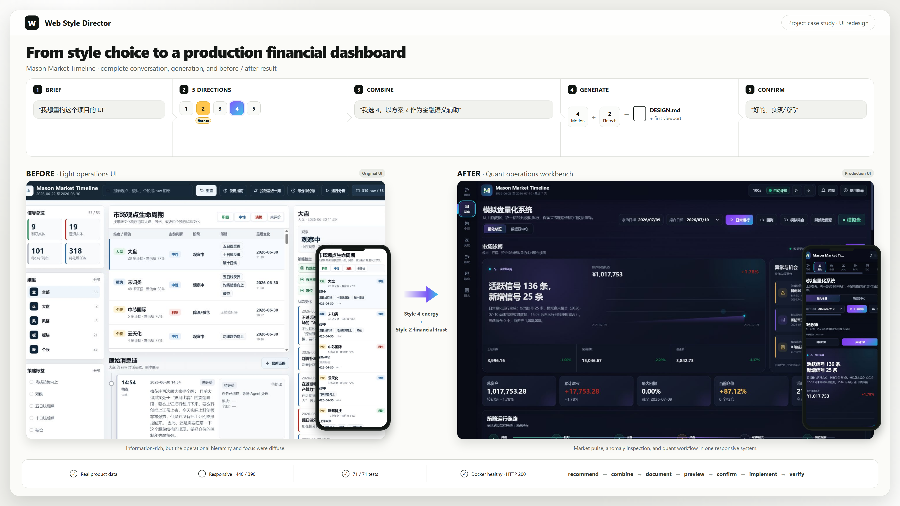

# AI UI Style Director

[简体中文](README.zh-CN.md)

AI UI Style Director is a UI-direction workflow for coding agents. Before a new website or redesign is implemented, it recommends five relevant visual directions. After you choose one, it generates a project-specific `DESIGN.md` and lets the agent start building from that contract.

Codex and Claude Code have first-class support on Windows, macOS, and Linux. Other Agent Skills-compatible tools are supported on a best-effort basis.

## Install

Send this to your coding agent:

```text
Read and follow:
https://raw.githubusercontent.com/coconilu/ai-ui-style-director/main/INSTALL.md

Install Web Style Director for the current agent and run its verification when finished.
```

Installation requires Git and Node.js 20 or newer.

## Use

Codex:

```text
$web-style-director I want to build an AI developer tool website
```

Claude Code:

```text
/web-style-director I want to build an AI developer tool website
```

The agent shows a brand-neutral SVG draft and upstream Light/Dark live-preview links for each of the five directions. After selection, it generates a project-specific `DESIGN.md` and first-viewport draft, then implements only after confirmation.

The agent orchestrates this workflow, but it does not improvise the match. The
Node.js core ranks the reviewed catalog with deterministic, testable rules, so
the same brief and catalog produce the same result.

## Browse the curated catalog

Open a searchable view of every curated style without starting a website
workflow:

Codex:

```text
$web-style-director serve
```

Claude Code:

```text
/web-style-director serve
```

Or run the CLI directly and open the page automatically:

```bash
node bin/ai-ui-style-director.mjs serve --open
```

The current catalog contains 48 reviewed profiles: four directions in each of
12 families. The page supports text search plus family, page type, density,
tone, and component-kit filters. It loads a lightweight schema-v2 catalog,
fetches previews from independent same-origin SVG routes, and progressively
renders 24 cards at a time.

The 74 generated style-source entries are upstream provider paths and remain a
source pool for human curation; they are not 74 additional styles. The page
reports that count without misrepresenting unreviewed paths as style cards.
`serve` is read-only and does not create or modify project
`.ui-style-director/` state.

The foreground service listens only on `127.0.0.1`, uses an available port by
default, and stops when you press Ctrl+C. Use `--port <number>` to request a
port, `--open` to launch the browser, or `--json` for machine-readable startup
output.

## Example: choose an admin dashboard direction

One prompt becomes five comparable directions before any UI code is written:


## Example: carry a selected direction into production

This real Mason Market Timeline refactor shows the complete gated workflow:
recommend five directions, combine direction 4 with direction 2's financial
semantics, generate a project-specific `DESIGN.md` and first-viewport draft,
then implement only after explicit confirmation. The image also keeps the
original UI visible beside the responsive production result.



This complete-catalog page is separate from a single recommendation preview.
For a terminal-only client, every recommendation also writes a self-contained
`.ui-style-director/recommendations.html` gallery. Start the local preview
server and open the printed link:

```bash
node bin/ai-ui-style-director.mjs preview --serve
```

The server listens only on `127.0.0.1`, chooses an available port, and runs
until you press Ctrl+C. `preview --open` remains available as a direct-file
fallback.

## Update

Codex:

```text
$web-style-director update
```

Claude Code:

```text
/web-style-director update
```

You can also say: `Update web-style-director and verify it afterward.`

## Uninstall

Codex:

```text
$web-style-director uninstall
```

Claude Code:

```text
/web-style-director uninstall
```

`delete` and “remove web-style-director” are also treated as uninstall intent. Uninstall removes only the tool; it does not delete project `DESIGN.md` files, `.ui-style-director/` state, or website code.

## Documentation

- [Workflow](docs/WORKFLOW.md)
- [Visual previews](docs/VISUAL_PREVIEWS.md)
- [Supported platforms](docs/PLATFORMS.md)
- [CLI reference](docs/CLI.md)
- [Providers and source boundaries](docs/PROVIDERS.md)
- [Architecture](docs/ARCHITECTURE.md)
- [Implementation and open-source integration](docs/IMPLEMENTATION.md)
- [Automated provider refresh](docs/AUTOMATED_REFRESH.md)
- [Development and maintenance](docs/DEVELOPMENT.md)
- [Third-party notices](THIRD_PARTY_NOTICES.md)

MIT License. Follow upstream licenses and do not copy protected brand assets, proprietary copy, or exact page layouts.
