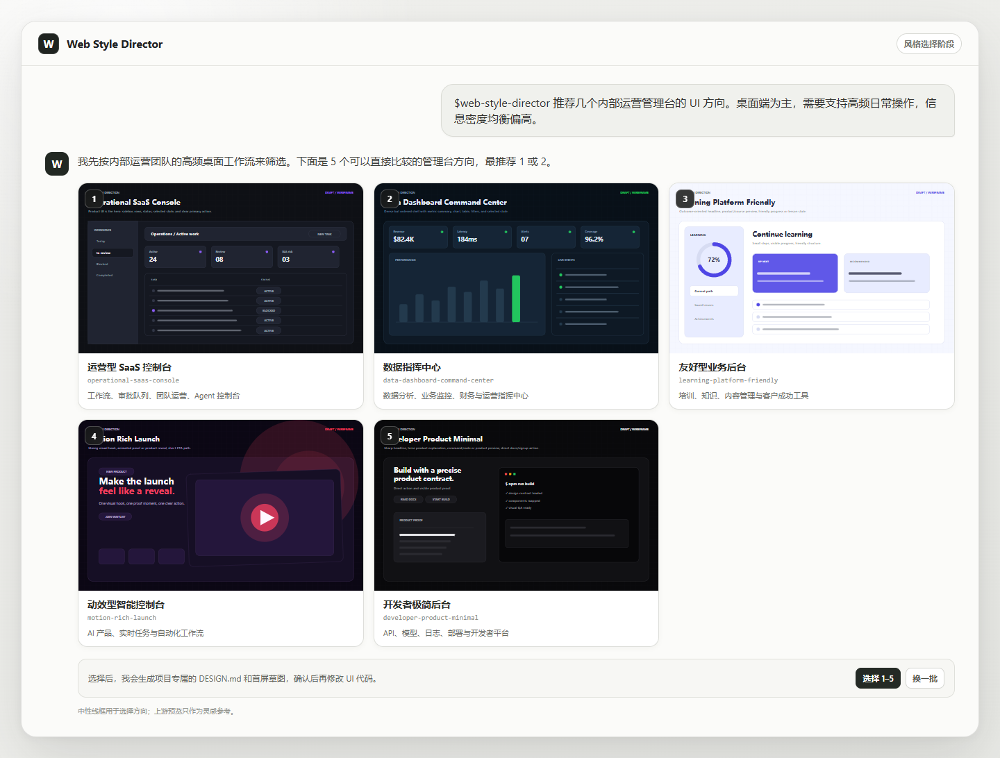
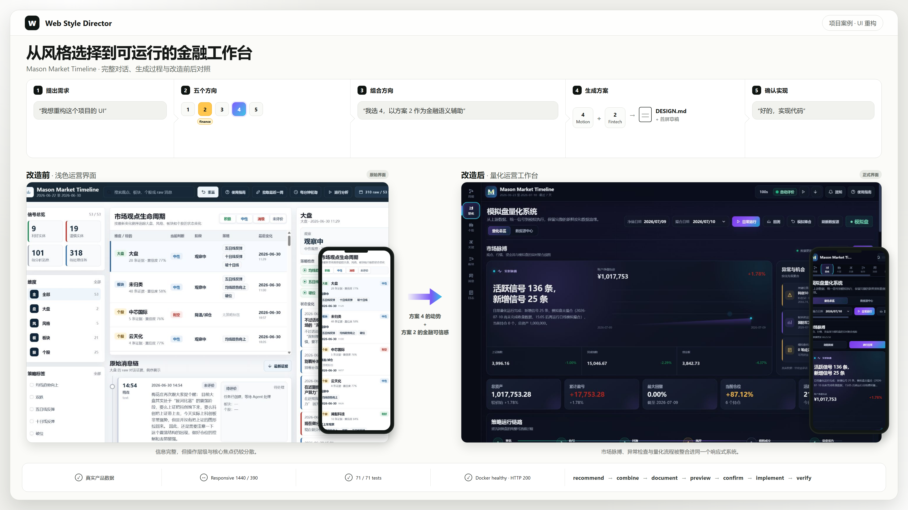

# AI UI Style Director

[English](README.md)

AI UI Style Director 是面向编程 agent 的 UI 风格决策工作流。在新建或重构网站之前，它会先推荐 5 个合适的视觉方向；你选定后，它会生成项目专属的 `DESIGN.md`，再让 agent 开始实现。

当前一等支持 Codex 与 Claude Code，可运行在 Windows、macOS 和 Linux。其他兼容 Agent Skills 的工具按 best-effort 方式支持。

## 安装

把下面这段话发给你的编程 agent：

```text
请阅读并执行：
https://raw.githubusercontent.com/coconilu/ai-ui-style-director/main/INSTALL.md

把 Web Style Director 安装到当前 agent，并在安装后完成自检。
```

安装过程需要 Git 和 Node.js 20 或更高版本。

## 使用

Codex：

```text
$web-style-director 我想做一个面向开发者的 AI 工具网站
```

Claude Code：

```text
/web-style-director 我想做一个面向开发者的 AI 工具网站
```

agent 会为 5 个方向分别展示一张无品牌 SVG 草图和上游 Light/Dark 实时预览链接。选定后，它会生成项目专属的 `DESIGN.md` 与首屏草图，确认后再实现网站。

## 示例：为管理台选择 UI 方向

一句需求，在写 UI 代码前得到 5 个可以直接比较的方向：



## 示例：把选定方向落实到正式界面

这个真实的 Mason Market Timeline 重构案例展示了完整的门控流程：先推荐
5 个方向，再把方案 4 与方案 2 的金融语义组合起来，生成项目专属的
`DESIGN.md` 和首屏草稿，并且只在用户明确确认后实现代码。图片同时保留
原始 UI，并与响应式正式界面并排对照。



使用纯终端客户端时，每次推荐还会生成自包含的
`.ui-style-director/recommendations.html` 画廊。启动本地预览服务，再打开命令
输出的链接：

```bash
node bin/ai-ui-style-director.mjs preview --serve
```

服务只监听 `127.0.0.1`，默认选择可用端口，按 Ctrl+C 后停止。
`preview --open` 仍可作为直接打开文件的降级方式。

## 更新

Codex：

```text
$web-style-director update
```

Claude Code：

```text
/web-style-director update
```

也可以说：`请更新 web-style-director，并在更新后完成自检。`

## 卸载

Codex：

```text
$web-style-director uninstall
```

Claude Code：

```text
/web-style-director uninstall
```

`delete` 和“删除 web-style-director”也会被识别为卸载意图。卸载只移除工具本身，不会删除项目中的 `DESIGN.md`、`.ui-style-director/` 或网站代码。

## 详细文档

- [工作流程](docs/WORKFLOW.zh-CN.md)
- [视觉预览](docs/VISUAL_PREVIEWS.zh-CN.md)
- [支持平台](docs/PLATFORMS.zh-CN.md)
- [CLI 参考](docs/CLI.zh-CN.md)
- [Provider 与来源边界](docs/PROVIDERS.zh-CN.md)
- [架构](docs/ARCHITECTURE.zh-CN.md)
- [实现详解与开源集成](docs/IMPLEMENTATION.zh-CN.md)
- [开发与维护](docs/DEVELOPMENT.zh-CN.md)
- [第三方声明](THIRD_PARTY_NOTICES.md)

MIT License。使用上游设计与组件资料时，请遵守对应许可证，不要复制受保护的品牌资产、专有文案或精确页面布局。
