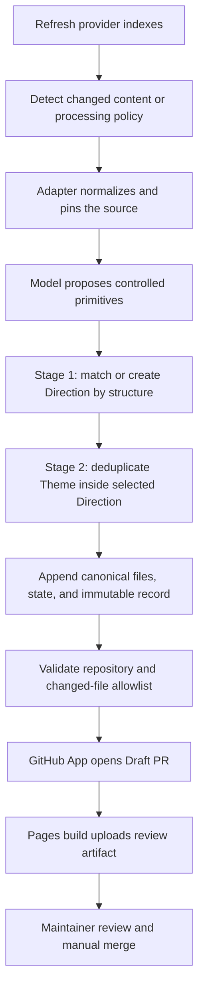

# Automated AI-Assisted Style Curation

This pipeline turns new or changed upstream style sources into reviewed
Direction/Theme catalog changes. The model interprets source material; trusted
Node.js code decides what may be written. Neither the model nor the GitHub App
can approve or merge its own proposal.

## End-to-end flow



1. `refresh-providers.yml` scans configured providers. A source has the stable
   identity `providerId + path` and a normalized SHA-256 content hash.
2. `curate-style-sources.yml` considers a source pending when its current hash
   or effective processing-policy hash differs from
   `catalog/curation/source-state.json`.
3. The workflow checks out the exact revision from
   `catalog/generated/provider-inventory.json`. The configured Adapter
   normalizes the source and the program verifies its indexed hash before any
   model call.
4. The OpenAI-compatible client sends only bounded source material, governed
   taxonomy, a limited reference pool, and nearby existing Directions. The
   source is explicitly treated as untrusted data.
5. The model returns `skip` or a schema-bound candidate. Programmatic checks
   validate the vocabulary, component kits, exact source references, theme
   tokens, and Adapter-derived constraints.
6. Trusted code performs the two-stage match described below and produces one
   explicit action.
7. A successful batch may append only canonical Direction/Theme files, source
   state, and immutable records. `npm run check` validates the repository.
8. Only after validation does the workflow create a write token for the
   existing `ai-ui-style-director-refresh` GitHub App. The App commits the
   allowlisted artifacts and opens a Draft PR. Auto-merge is never enabled.
9. The Catalog Pages pull-request build renders every canonical preview and
   uploads the validated site as a short-lived Actions artifact. The build
   summary links the artifact for maintainer review; only merged `main` deploys
   the production Pages site.

The GitHub App is the audited repository identity, not the reasoning engine.
Catalog metadata never authorizes credentials, network access, shell/tool
execution, or instruction changes.

## Canonical write model

Automated curation writes the Direction/Theme catalog directly:

| File | Purpose |
| --- | --- |
| `catalog/style-directions.json` | Reusable structural and information-hierarchy Directions |
| `catalog/style-themes.json` | Reusable color-token Themes with pinned provenance |
| `catalog/style-direction-themes.json` | Allowed Direction/Theme links and each Direction's default Theme |
| `catalog/style-preview-specs.json` | Program-owned structural preview specifications for Directions |

It does **not** create or modify legacy `style-profiles.json`,
`style-visuals.json`, `style-aliases.json`, or committed SVG previews. Those
legacy files and aliases remain compatibility inputs for older IDs; they are
not an automated-growth target.

`npm run catalog:v2:migrate:check` verifies that the legacy projection remains
a subset of the canonical catalog. `npm run catalog:v2:migrate` can refresh
that projection while preserving canonical-only Directions, Themes, links, and
PreviewSpecs. Canonical additions therefore survive later compatibility
migrations.

### Two-stage deterministic matching

| Stage | Compared data | Scope | Outcome |
| --- | --- | --- | --- |
| Direction | composition, emphasis, family, page types, goals, audiences, density, and keywords | all eligible Directions | select an existing Direction at `>= 0.85`, or create one only when capability allows |
| Theme | seven canonical color tokens | Themes already linked to the selected Direction | `duplicate-theme` at distance `<= 0.04`; otherwise add or link a Theme |

Palette and tone do not affect the Direction structural score. Conversely,
Theme duplicate comparison happens only after a Direction has been selected,
so two layouts that share colors are not collapsed into one Direction.

The possible v2 actions are:

| Action | Canonical effect |
| --- | --- |
| `created-direction-and-theme` | add Direction, Theme, link, and PreviewSpec |
| `created-direction-with-existing-theme` | add Direction, link, and PreviewSpec |
| `added-theme-to-direction` | add Theme and link it to an existing Direction |
| `linked-existing-theme` | add only a Direction/Theme link |
| `duplicate-theme` | retain the selected existing Direction/Theme pair; no catalog write |
| `skipped` / `invalid` | audit only; no catalog write |

Direction and Theme IDs are deterministic from governed structural primitives
and canonical theme tokens respectively. New Theme provenance is pinned to the
exact provider repository, revision, path, and content hash processed by the
event.

### Classifying new Directions

The controlled candidate Profile includes one `experienceType` from the shared
six-value taxonomy: `consumer-app`, `marketing-site`, `commerce`,
`content-docs`, `business-app`, or `admin-console`. The curator uses the
primary first-viewport user task, page types, goals, and audiences; `family`
alone is never a classification rule.

Only a newly created Direction persists the candidate value. Matching an
existing Direction keeps its reviewed `experienceType`, and a Theme-only
Provider can neither create a Direction nor change its classification. Prompt
version `direction-theme-curation-v2` introduces this candidate field. The
processing-policy version remains unchanged, so the Prompt update does not
replay the 109 historical sources or rewrite immutable records.

## Capability boundary

Each Adapter has a hard capability ceiling. A Provider may explicitly narrow
that ceiling with `capabilities`; it cannot widen it:

```text
effective.createDirection = adapter.createDirection AND provider.createDirection
effective.createTheme     = adapter.createTheme     AND provider.createTheme
```

| Adapter | Adapter ceiling | Current use |
| --- | --- | --- |
| `awesome-design-md` | Direction + Theme | governed `DESIGN.md` corpus |
| `generic-design-md` | Direction + Theme | future generic `DESIGN.md` providers |
| `daisyui-theme-css` | Theme only | `daisyui-themes` |

A Theme-only source can never create a Direction. For a changed historical
source, the program first resolves its retained `styleIds` through immutable
aliases and reuses that Direction. For a new source, it may select only a
sufficiently similar existing Direction from the bounded allowed context. If
no eligible Direction exists, the result is `invalid`; the model cannot invent
or name an arbitrary target Direction.

The effective capability snapshot is included in the processing-policy hash
and in every new v2 audit record.

## State and audit contract

`catalog/curation/source-state.json` schema v2 is the compact processing cursor.
Every entry contains:

| Field | Meaning |
| --- | --- |
| `providerId`, `path` | stable source identity |
| `processedHash` | normalized content hash last processed |
| `processingPolicyHash` | SHA-256 of policy version, Adapter, normalizer, and effective capabilities |
| `status`, `recordId` | processing result and immutable event record |
| `styleIds` | retained legacy IDs for compatibility |
| `directionIds`, `themeIds` | retained canonical selection |

The checked-in migration covers all 109 indexed sources: 74 original baseline
entries and 35 already processed daisyUI entries. Legacy `styleIds` are mapped
through `style-aliases.json` into retained Direction/Theme IDs. Existing source
history is not replayed merely to change the state schema.

Processing policy is explicitly versioned (`processingPolicyVersion=1`). A
source becomes pending when its content hash changes or when its per-source
policy hash changes. The root `promptVersion` is audit metadata, not a queue
key: bumping the prompt alone does not automatically spend tokens to re-curate
all historical sources. A deliberate policy/Adapter/normalizer/capability
change can make only the affected sources pending.

When maintainers intentionally need every applicable source to run under a new
deterministic policy, increment `CURATION_PROCESSING_POLICY_VERSION` in
`src/curation.mjs`. Adapter normalizer or capability changes already alter the
hash only for affected Providers; changing `CURATION_PROMPT_VERSION` alone does
not schedule a replay.

Immutable record schema v1 remains accepted exactly as written. Existing v1
files are never rehashed, rewritten, or deleted. New events use record schema
v2 and add:

- a complete source snapshot, including revision, content hash, Adapter,
  normalizer, effective capabilities, policy version/hash, truncation state,
  and consumed character count;
- the Adapter ceiling, Provider declaration, and effective capability gate;
- separate Direction and Theme checks;
- a typed `result.action` with resolved Direction/Theme IDs;
- exact canonical promotion files and workflow provenance.

Record IDs bind source identity/type/content hash, Adapter/normalizer, prompt
and response identities, policy and capability snapshot, transition hashes,
timestamp, and collision nonce. The record stores the additional source
snapshot fields for audit. API keys, authorization headers, and raw requests
are never stored.

Historical Theme sources remain pinned to the revision that created them. A
later provider refresh does not rewrite that historical provenance to the
current upstream revision; a new event records its own current source snapshot.

## Provider adapters

Provider scanning has no fixed source or user-choice count. Add a provider to
`catalog/providers.json`; a non-Awesome provider defaults to
`generic-design-md`, which recursively discovers files named `DESIGN.md`.

`daisyui-theme-css` discovers only
`packages/daisyui/src/themes/*.css`, assigns `sourceType=theme-css`, parses the
governed color/geometry declarations, converts OKLCH deterministically, and
serializes canonical JSON. That JSON is both the hash input and the bounded
model material. Arbitrary CSS, imports, comments, and instructions are not
passed through as catalog prose.

The Adapter requires exactly 29 declarations: one `color-scheme`, 20 governed
color properties, and eight geometry properties. Unknown, missing, duplicate,
or malformed declarations fail closed. Supporting an upstream schema change
requires a reviewed code PR and a normalizer-version bump.

See [Providers and source boundaries](PROVIDERS.md) for onboarding details.

## GitHub configuration

The existing App configuration is reused:

| Kind | Name |
| --- | --- |
| Repository variable | `REFRESH_APP_CLIENT_ID` |
| Repository secret | `REFRESH_APP_PRIVATE_KEY` |
| Model selector | optional `CURATOR_PROVIDER` variable; defaults to `deepseek` |
| DeepSeek secret | `DEEPSEEK_API_KEY` |
| Kimi secret | `KIMI_CODE_API_KEY` |

| Provider | Base URL | Model | Temperature | Thinking |
| --- | --- | --- | ---: | --- |
| `deepseek` (default) | `https://api.deepseek.com` | `deepseek-v4-flash` | `0` | disabled |
| `kimi` | `https://api.kimi.com/coding/v1` | `kimi-for-coding` | `1` | omitted |

The workflow maps only the selected provider secret to `CURATOR_API_KEY`.
Manual dispatch exposes the same provider choice.

Shared bounded-execution defaults are:

```text
CURATOR_BATCH_SIZE=5
CURATOR_MAX_INPUT_CHARS=80000
CURATOR_MAX_OUTPUT_TOKENS=4096
CURATOR_MAX_RETRIES=1
CURATOR_REQUEST_TIMEOUT_MS=120000
```

Five is a per-model-call batch size, not a per-run or catalog-size limit. The
workflow runs the curator with `--drain`, loops until the pending queue is
empty, and publishes one guarded Draft PR. Strictly decreasing remaining
counts and a 120-minute job timeout prevent a stalled loop from publishing a
partial proposal. An earlier open curation PR causes the run to skip before
paid model work begins.

The Action and CI enforce this changed-file allowlist:

```text
catalog/style-directions.json
catalog/style-themes.json
catalog/style-direction-themes.json
catalog/style-preview-specs.json
catalog/curation/source-state.json
catalog/curation/records/<sha256>.json   # additions only
```

Deleted files, modified old records, legacy profile/visual/alias changes, SVG
changes, and undeclared files are rejected. The Draft PR summary reports each
Direction/Theme action and keeps the full normalized decision in its immutable
record.

## Local operations

Validate state, immutable records, and canonical provenance:

```bash
npm run catalog:curation:validate
npm run catalog:v2:migrate:check
npm run catalog:v2:validate
```

Create a baseline only for a fresh deployment with no existing state:

```bash
npm run catalog:curate:baseline
```

GitHub Actions is the primary execution path. A diagnostic local DeepSeek run
is:

```bash
CURATOR_PROVIDER=deepseek \
CURATOR_BASE_URL=https://api.deepseek.com \
CURATOR_MODEL=deepseek-v4-flash \
CURATOR_TEMPERATURE=0 \
CURATOR_THINKING=disabled \
CURATOR_API_KEY=... \
npm run catalog:curate -- --drain --clone --batch-size 5
```

The command is a clean no-op when nothing is pending. Infrastructure or
authentication errors fail without advancing state. A schema-invalid model
result receives one bounded repair attempt; a second invalid result is
recorded as terminal for the same content and processing policy, preventing an
unbounded paid retry loop.

## Scale boundary

Duplicate comparison scans governed canonical metadata, not raw provider
repositories. This is sufficient for the current tens-to-hundreds scale. If
the catalog grows into the thousands, persisted structural signatures or a
search/embedding index can replace the scan without changing source identity,
state, record immutability, or the Direction/Theme contract.
