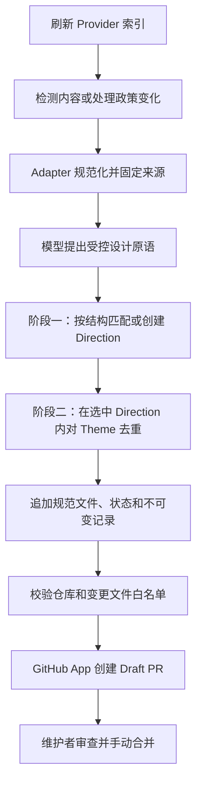

# AI 辅助风格策展自动化

这条流水线把新增或变化的上游风格来源转换为需要人工审查的 Direction/Theme Catalog
变更。模型负责理解来源，可信 Node.js 程序决定允许写入什么；模型和 GitHub App 都不能
自行批准或合并提案。

## 完整流程



1. `refresh-providers.yml` 扫描配置的 Provider。来源以 `providerId + path` 作为
   稳定身份，以规范化内容的 SHA-256 作为内容版本。
2. `curate-style-sources.yml` 对照 `catalog/curation/source-state.json`；当前内容
   哈希或有效处理政策哈希变化时，来源进入 pending。
3. Workflow 按 `catalog/generated/provider-inventory.json` 中的精确 revision 检出
   Provider。对应 Adapter 规范化来源，程序在模型调用前核对索引哈希。
4. OpenAI-compatible 客户端只发送受限的来源内容、治理 taxonomy、有限参考池和
   附近的既有 Direction，并明确把来源视为不可信数据。
5. 模型返回 `skip` 或符合 Schema 的候选。程序校验词表、组件库、精确来源引用、
   Theme token 和 Adapter 推导约束。
6. 可信程序执行下述两阶段匹配，产出一个显式 action。
7. 通过的批次只能追加规范 Direction/Theme 文件、来源状态和不可变记录，随后由
   `npm run check` 校验完整仓库。
8. 只有全部校验通过后，Workflow 才为现有 `ai-ui-style-director-refresh`
   GitHub App 创建写 Token。App 提交白名单文件并创建 Draft PR；永不自动合并。

GitHub App 是可审计的仓库操作身份，不是推理引擎。Catalog 元数据绝不授权凭证访问、
网络请求、Shell/工具执行或指令变更。

## 规范写入模型

自动策展直接写入 Direction/Theme Catalog：

| 文件 | 作用 |
| --- | --- |
| `catalog/style-directions.json` | 可复用的结构与信息层级 Direction |
| `catalog/style-themes.json` | 带固定溯源的可复用颜色 Token Theme |
| `catalog/style-direction-themes.json` | 允许的 Direction/Theme 组合及每个 Direction 的默认 Theme |
| `catalog/style-preview-specs.json` | 程序所有的 Direction 结构预览规格 |

它**不会**创建或修改旧版 `style-profiles.json`、`style-visuals.json`、
`style-aliases.json` 或仓库内 SVG 预览。旧文件和 alias 只作为旧 ID 的兼容输入，
不是自动扩展目标。

`npm run catalog:v2:migrate:check` 校验旧版投影仍是规范 Catalog 的子集；
`npm run catalog:v2:migrate` 刷新旧版投影时，会保留只存在于规范层的 Direction、
Theme、link 和 PreviewSpec。因此后续兼容迁移不会删除规范新增条目。

### 两阶段确定性匹配

| 阶段 | 比较内容 | 范围 | 结果 |
| --- | --- | --- | --- |
| Direction | composition、emphasis、family、页面类型、目标、受众、密度和关键词 | 所有符合资格的 Direction | 分数 `>= 0.85` 时选择既有 Direction；只有 capability 允许时才可创建 |
| Theme | 7 个规范颜色 Token | 已与选中 Direction 关联的 Theme | 距离 `<= 0.04` 时为 `duplicate-theme`，否则新增或关联 Theme |

色板和 tone 不参与 Direction 结构分数；Theme 去重则只在 Direction 已确定后进行。
因此，相同颜色不会把两个不同布局折叠成一个 Direction。

v2 可能产生以下 action：

| Action | 规范层效果 |
| --- | --- |
| `created-direction-and-theme` | 新增 Direction、Theme、link 和 PreviewSpec |
| `created-direction-with-existing-theme` | 新增 Direction、link 和 PreviewSpec |
| `added-theme-to-direction` | 新增 Theme 并关联到既有 Direction |
| `linked-existing-theme` | 只新增 Direction/Theme link |
| `duplicate-theme` | 保留选中的既有 Direction/Theme 组合，不改 Catalog |
| `skipped` / `invalid` | 只留审计记录，不改 Catalog |

Direction ID 由受治理的结构原语确定性生成，Theme ID 由规范 Theme token 确定性生成。
新 Theme 的溯源固定到本次事件处理的 Provider 仓库、revision、路径和内容哈希。

### 为新 Direction 分类

受控候选 Profile 必须从共享的六值 taxonomy 中选择一个 `experienceType`：
`consumer-app`、`marketing-site`、`commerce`、`content-docs`、
`business-app` 或 `admin-console`。策展 Agent 结合首屏主要用户任务、页面类型、
目标和受众进行判断；`family` 本身绝不是分类规则。

只有真正创建新 Direction 时才持久化候选值。匹配到既有 Direction 时保留已经审阅的
`experienceType`；仅 Theme Provider 既不能创建 Direction，也不能修改其分类。
Prompt `direction-theme-curation-v2` 引入该候选字段，但处理政策版本保持不变，
因此不会重放 109 条历史来源，也不会改写不可变 record。

## Capability 边界

每个 Adapter 都有不可突破的 capability 上限。Provider 可以用 `capabilities` 显式
收窄该上限，但不能扩大：

```text
effective.createDirection = adapter.createDirection AND provider.createDirection
effective.createTheme     = adapter.createTheme     AND provider.createTheme
```

| Adapter | Adapter 上限 | 当前用途 |
| --- | --- | --- |
| `awesome-design-md` | Direction + Theme | 受治理的 `DESIGN.md` 语料 |
| `generic-design-md` | Direction + Theme | 未来通用 `DESIGN.md` Provider |
| `daisyui-theme-css` | 仅 Theme | `daisyui-themes` |

仅 Theme 来源绝不能创建 Direction。对于已有历史状态的变化来源，程序优先把保留的
`styleIds` 通过不可变 alias 还原到原 Direction；对于全新来源，只能从受限候选上下文
中选择结构足够相似的既有 Direction。没有符合条件的 Direction 时，结果为 `invalid`；
模型不能虚构或任意指定目标 Direction。

有效 capability 快照同时进入处理政策哈希和每条新的 v2 审计记录。

## 状态与审计契约

`catalog/curation/source-state.json` schema v2 是紧凑的处理游标。每条 entry 包含：

| 字段 | 含义 |
| --- | --- |
| `providerId`、`path` | 稳定来源身份 |
| `processedHash` | 最近一次处理的规范内容哈希 |
| `processingPolicyHash` | 处理政策版本、Adapter、Normalizer 和有效 capability 的 SHA-256 |
| `status`、`recordId` | 处理结果和不可变事件记录 |
| `styleIds` | 为兼容保留的旧版 ID |
| `directionIds`、`themeIds` | 保留的规范选择 |

仓库内迁移覆盖全部 109 条索引来源：74 条原始 baseline 和 35 条已处理的 daisyUI
来源。旧版 `styleIds` 通过 `style-aliases.json` 映射到保留的 Direction/Theme ID；
状态 Schema 升级不会重放已有来源历史。

处理政策使用显式版本（`processingPolicyVersion=1`）。内容哈希变化或逐来源政策哈希
变化时，该来源才重新进入 pending。根级 `promptVersion` 是审计元数据，不是队列键：
只提升 Prompt 不会自动消耗 Token 重新策展所有历史来源。显式政策、Adapter、
Normalizer 或 capability 变化，可以只让受影响来源重新进入队列。

若维护者有意让所有适用来源按新的确定性政策重新处理，应递增 `src/curation.mjs` 中的
`CURATION_PROCESSING_POLICY_VERSION`。Adapter Normalizer 或 capability 变化会自动只
改变受影响 Provider 的哈希；仅修改 `CURATION_PROMPT_VERSION` 不会安排历史重放。

不可变 record schema v1 继续按原样兼容；已有 v1 文件永不重新哈希、改写或删除。
新事件使用 record schema v2，并增加：

- 完整来源快照：revision、内容哈希、Adapter、Normalizer、有效 capability、政策版本/
  哈希、截断状态和实际消费字符数；
- Adapter 上限、Provider 声明和最终有效 capability 门禁；
- 独立的 Direction 与 Theme 检查；
- 带解析后 Direction/Theme ID 的强类型 `result.action`；
- 精确的规范 promotion 文件和 Workflow 溯源。

record ID 绑定来源身份/类型/内容哈希、Adapter/Normalizer、Prompt/响应身份、政策和
capability 快照、转换前后哈希、时间戳与碰撞 nonce；其他来源快照字段保存在 record 中
用于审计。API Key、Authorization Header 和原始请求永不落盘。

历史 Theme 来源始终固定到创建它时的 revision。后续 Provider 刷新不会把历史溯源
改写成当前上游 revision；新事件会记录自己的当前来源快照。

## Provider Adapter

Provider 扫描没有固定的来源数量或用户选择数量。向 `catalog/providers.json` 增加
Provider 即可；非 Awesome Provider 默认使用 `generic-design-md`，递归发现文件名为
`DESIGN.md` 的资料。

`daisyui-theme-css` 只发现 `packages/daisyui/src/themes/*.css`，标记
`sourceType=theme-css`，解析受治理的颜色/几何声明，确定性转换 OKLCH，再序列化为规范
JSON。这份 JSON 同时作为内容哈希输入和受限模型资料；任意 CSS、import、注释和指令
都不会透传为 Catalog 文案。

该 Adapter 精确要求 29 个声明：1 个 `color-scheme`、20 个受治理颜色属性和 8 个
几何属性。未知、缺失、重复或格式非法的声明都会 fail closed。支持上游 Schema 变化
必须通过人工审查代码 PR 并提升 Normalizer 版本。

接入细节见 [Provider 与来源边界](PROVIDERS.zh-CN.md)。

## GitHub 配置

继续复用现有 GitHub App：

| 类型 | 名称 |
| --- | --- |
| Repository variable | `REFRESH_APP_CLIENT_ID` |
| Repository secret | `REFRESH_APP_PRIVATE_KEY` |
| 模型选择 | 可选变量 `CURATOR_PROVIDER`，默认 `deepseek` |
| DeepSeek secret | `DEEPSEEK_API_KEY` |
| Kimi secret | `KIMI_CODE_API_KEY` |

| Provider | Base URL | Model | Temperature | Thinking |
| --- | --- | --- | ---: | --- |
| `deepseek`（默认） | `https://api.deepseek.com` | `deepseek-v4-flash` | `0` | disabled |
| `kimi` | `https://api.kimi.com/coding/v1` | `kimi-for-coding` | `1` | 不发送 |

Workflow 只把当前选择的 Provider secret 映射为 `CURATOR_API_KEY`；手动触发也提供同样
的 Provider 选择。

共享的受限执行默认值为：

```text
CURATOR_BATCH_SIZE=5
CURATOR_MAX_INPUT_CHARS=80000
CURATOR_MAX_OUTPUT_TOKENS=4096
CURATOR_MAX_RETRIES=1
CURATOR_REQUEST_TIMEOUT_MS=120000
```

5 是单次模型调用的批量大小，不是单次运行或 Catalog 总量上限。Workflow 使用
`--drain` 循环，直到 pending 队列清空，再发布一个受保护的 Draft PR。remaining 必须
严格递减，任务总超时为 120 分钟，避免卡住的循环发布部分提案。若已有策展 PR 未关闭，
任务会在付费模型调用前跳过。

Action 与 CI 强制执行以下变更文件白名单：

```text
catalog/style-directions.json
catalog/style-themes.json
catalog/style-direction-themes.json
catalog/style-preview-specs.json
catalog/curation/source-state.json
catalog/curation/records/<sha256>.json   # 只允许新增
```

删除文件、修改旧 record、改动旧版 profile/visual/alias、改动 SVG 或加入未声明文件都会
被拒绝。Draft PR 摘要按 Direction/Theme action 展示结果，完整规范决策保留在不可变
record 中。

## 本地操作

校验状态、不可变记录和规范溯源：

```bash
npm run catalog:curation:validate
npm run catalog:v2:migrate:check
npm run catalog:v2:validate
```

只在全新部署且没有既有状态时创建 baseline：

```bash
npm run catalog:curate:baseline
```

GitHub Actions 是主要执行路径。使用 DeepSeek 做本地诊断时：

```bash
CURATOR_PROVIDER=deepseek \
CURATOR_BASE_URL=https://api.deepseek.com \
CURATOR_MODEL=deepseek-v4-flash \
CURATOR_TEMPERATURE=0 \
CURATOR_THINKING=disabled \
CURATOR_API_KEY=... \
npm run catalog:curate -- --drain --clone --batch-size 5
```

没有 pending 时命令会直接 no-op，不要求 API Key。基础设施或鉴权错误不会推进状态。
模型结果不符合 Schema 时，程序会进行一次受限修复；第二次仍非法才会记录为同一内容
和处理政策下的终态 `invalid`，避免无限付费重试。

## 规模边界

重复比较只扫描受治理的规范元数据，不扫描 Provider 原始仓库，足以支撑当前数十到数百
条目的规模。若未来增长到数千条，可以引入持久化结构签名或搜索/Embedding 索引，
而无需改变来源身份、状态、record 不可变性或 Direction/Theme 契约。
