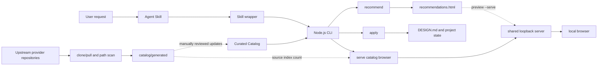

# Implementation and Open-Source Integration

This document explains how AI UI Style Director combines an agent workflow, deterministic recommendation, visual previews, project design contracts, and upstream open-source material.

It is not a frontend component aggregator and does not automatically install components into a target project. Its job is to complete three steps before UI code is written:

1. match a project brief to comparable visual directions;
2. let the user choose through SVG cards, an HTML gallery, and external references;
3. lock the selected direction into a project `DESIGN.md` and machine-readable state.

## Runtime architecture



Runtime recommendation and upstream synchronization are deliberately separate. Recommendations read reviewed Catalog data; provider refreshes generate source indexes but never change recommendation behavior automatically.

## Entrypoints and call path

### 1. Agent Skill: control when UI implementation may begin

`skills/web-style-director/SKILL.md` is the workflow entrypoint for coding agents such as Codex and Claude Code. It requires the agent to gather missing context, present five directions, support rerolling with `--again`, run `apply` after selection, and wait for first-viewport confirmation before writing UI code.

An explicit `serve` or complete-catalog browsing request takes a separate
top-level route through `references/catalog-browser.md`. The agent starts the
foreground service and does not gather a website brief, recommend five styles,
run `apply`, or modify a target project.

The Skill defines behavior and gates. It does not contain or improvise the
recommendation algorithm; the deterministic Node.js core performs matching.

### 2. Skill wrapper: locate the real CLI

`skills/web-style-director/scripts/style-director.mjs` searches `AI_UI_STYLE_DIRECTOR_HOME`, the in-repository layout, Codex and Claude Code tool directories, and compatible skill asset layouts. It then starts `bin/ai-ui-style-director.mjs` with the current Node.js executable while forwarding arguments and the working directory.

This lets multiple agents share the same core implementation without requiring the same installation layout.

### 3. CLI: parse arguments and dispatch commands

`bin/ai-ui-style-director.mjs` is a thin command layer. Recommendation,
project-contract, preview, and provider operations dispatch to `src/core.mjs`;
the complete-catalog command dispatches directly to
`startStyleCatalogServer` in `src/catalog-browser.mjs`.

| Command | Responsibility |
| --- | --- |
| `questions` | Return intake questions for an underspecified brief |
| `recommend` | Rank directions, update session state, and generate an HTML gallery |
| `serve` | Browse all curated styles with search and tag filters |
| `preview` | Inspect or open one generated recommendation gallery |
| `apply` | Generate the project design contract and state files |
| `sync` | Clone or update configured provider repositories |
| `refresh-catalog` | Scan providers and rebuild source indexes |

`update` is a compatibility alias for `refresh-catalog`; it does not update an installed copy of the tool.

### 4. Catalog browser and shared loopback server

`src/catalog-browser.mjs` exports four focused operations:

- `buildStyleCatalog`: join curated profiles, visual metadata, generated SVG
  preview URLs, indexes, and source-index statistics into the schema-v2 browser
  view model;
- `filterCatalogEntries`: apply text search and family, page type, density,
  tone, and component-kit filters;
- `renderCatalogBrowserPage`: render the browser shell;
- `startStyleCatalogServer`: expose the page and assets as a foreground
  loopback service.

The catalog service exposes `/`, `/catalog.json`, `/app.js`, `/styles.css`, and
one validated `/previews/<style-id>.svg` route per curated profile. The JSON
uses lightweight `previewUrl` values instead of embedded image data; preview
routes are same-origin and use a same-origin resource policy. Page state is
encoded in the URL query, allowing a filtered view to survive refresh without
server-side state.

The browser model includes a token-to-numeric-entry postings index and an
ID-to-entry index. Numeric postings keep repeated style IDs out of the search
index. Exact tokens are intersected through the postings lists; a missing
exact token falls back to substring search so partial terms still work. The
client renders the current result set in batches of 24 cards, limiting initial
DOM and image work without changing the total match count.

`src/loopback-server.mjs` owns the common `127.0.0.1` listener, port
validation, no-cache response behavior, method and path handling, and graceful
shutdown. `src/core.mjs` keeps the existing
`startRecommendationPreviewServer` API but delegates its HTTP transport to
this shared module. The two callers therefore share the same local-only
boundary while serving different content.

## Catalog: the runtime knowledge source

Recommendation and project-contract behavior read four curated datasets:

| File | Purpose |
| --- | --- |
| `catalog/style-profiles.json` | Page types, audiences, goals, density, tone, layout, palette, and component suggestions |
| `catalog/style-visuals.json` | SVG variants, theme colors, and real-reference slugs |
| `catalog/component-kits.json` | Component-library fit and usage boundaries |
| `catalog/scenario-questions.json` | Questions for an underspecified brief |

The current catalog contains 48 profiles: four in each of 12 families. A
separate `catalog/recommendation-benchmarks.json` file contains 12 representative
briefs used by the test suite to protect family-level intent coverage.

`catalog/providers.json` describes upstream repositories. `catalog/generated/*` records scan results. The recommendation core does not read those generated indexes, so upstream changes cannot enter user-facing recommendations without review.

The catalog browser reads `catalog/generated/style-sources.json` only to show
its current source-index count. At this revision the file contains 74 provider
paths, but those paths are not semantically parsed and are not returned as 74
complete style cards. Browser entries still come only from the 48 reviewed
profiles in `catalog/style-profiles.json`.

`scripts/validate-curated-catalog.mjs` applies `catalog/curation-policy.json`,
which requires at least four profiles and three distinct visual variants in
each baseline family. It also enforces unique IDs, complete profile fields and
taxonomy values, one-to-one profile/visual mapping, supported visual variants,
complete hex-color themes, exactly three unique references backed by the
provider source index, and the presence of every committed preview.

## Recommendation algorithm

Recommendation in `src/core.mjs` is deterministic rule matching. It does not
require an LLM, embeddings, or a vector database. The Agent orchestrates
intake, selection, and confirmation around this programmatic result.

### Brief normalization

`normalizeBrief` expands common Chinese scenario terms into English keywords, lowercases the input, removes non-alphanumeric characters, and normalizes whitespace. `isBriefInsufficient` requires at least one recognized product or page scenario before ranking profiles.

### Weighted scoring

Profile fields use three weight groups:

- high: family, keywords, page types, audiences, and goals;
- medium: tones, density, and best-fit scenarios;
- low: layout rules.

Matching uses normalized token boundaries and light plural canonicalization,
while generic words such as `website`, `product`, and `team` do not qualify a
brief by themselves. Identical inputs and Catalog data produce identical
ordering, which keeps recommendation testable and reproducible.

### Diversification and rerolling

Diversification first discards zero-score entries and results below 15% of the
best score. It otherwise keeps score order, promoting a new `family` only when
its score is at least 80% of the best remaining candidate. This keeps
relevance primary while allowing near-score alternatives to add useful visual
range.

The 12-case benchmark asserts the expected Top-1 family, required Top-5 family
coverage, and identical style IDs and scores across repeated runs.

Session state lives in `.ui-style-director/session.json`. With `--again`, the core excludes `shownStyleIds` and appends the next results. It reports `exhausted` when fewer unseen styles remain than requested.

## Visual previews and recommendation galleries

### SVG previews

`src/preview.mjs` renders normalized visual metadata into deterministic SVG wireframes. Each `variant` represents a page structure such as an app shell, dashboard, docs, commerce, or portfolio.

`scripts/generate-style-previews.mjs` generates `catalog/previews/*.svg` for every profile. Its `--check` mode verifies committed previews without writing files.

### Per-recommendation HTML gallery

After a successful recommendation, `writeRecommendationGallery` writes `.ui-style-director/recommendations.html` next to the session file:

- all five SVG cards are embedded as data URIs;
- CSS, localized copy, and result data are stored in one file;
- upstream Light/Dark previews remain external links;
- `preview --open` selects `rundll32.exe`, `open`, or `xdg-open` for the current platform;
- `preview --serve` starts a foreground, no-cache HTTP server on
  `127.0.0.1`, serving only the selected gallery on an available port.

The gallery and local server both work offline. Network access is only needed
to visit upstream references. The server stops on Ctrl+C.

### Complete-catalog browser

`serve` creates no recommendation session and writes no project files. It
starts `startStyleCatalogServer`, prints the selected
`http://127.0.0.1:<port>/` URL, optionally opens it, and stays in the foreground
until Ctrl+C. Port `0` lets the operating system choose an available port;
`--port` requests a specific port and `--json` makes the startup output
machine-readable.

The client loads the reviewed schema-v2 view model from `/catalog.json`, uses
the inverted search index and facet tags in the page, and progressively renders
24 matching cards at a time. Generated SVG previews load independently from
same-origin routes, while upstream references remain subject to the same
neutral-asset and external-link boundaries as recommendation galleries.

## `apply` and the project design contract

After selection, `applyStyle` writes:

```text
DESIGN.md
.ui-style-director/
  first-viewport-draft.svg
  selected-style.json
  recommended-components.json
  source-attribution.json
```

`DESIGN.md` records source intent, project brief, visual references, first viewport, layout rules, color roles, typography, component guidance, risks, and implementation constraints. The JSON files provide structured state for later agents and automation.

An existing `DESIGN.md` is protected by default and is replaced only when `--force` is supplied.

## How open-source projects are integrated

Open-source material is connected through provider metadata and an adapter-like synchronization pipeline, not declared as runtime npm dependencies.

| Provider | Role | Integration |
| --- | --- | --- |
| `VoltAgent/awesome-design-md` | Style-reference corpus | Scan `DESIGN.md`, curate profiles, and expand slugs into external Light/Dark previews |
| `Harzva/design-md-flow` | Workflow reference | Track source and revision while implementing a local selection gate |
| `shadcn-ui/ui` | Base components | Scan registry sources and recommend the kit from matching profiles |
| `shadcn/originui` | Application and marketing blocks | Scan registry sources and map the kit to practical SaaS surfaces |
| `magicuidesign/magicui` | Motion-rich marketing components | Use as both a motion direction source and an optional component kit |
| `tremorlabs/tremor` | Dashboards and charts | Use as both a data-heavy direction source and an optional component kit |

A component-kit selection only adds guidance to recommendation output and `DESIGN.md`. Installation, copying, or code generation remains the responsibility of the target-project agent, which must account for framework, version, license, and user constraints.

## Provider refresh and source indexes

`syncProviders` shallow-clones missing repositories, fast-forward pulls existing caches, and writes `providers-lock.json` with status and cache locations.

`updateCatalog` then recursively scans each cache while ignoring Git metadata, dependencies, build outputs, and cache directories. It records revisions, branches, `DESIGN.md` paths, registry paths, and documentation paths in:

```text
catalog/generated/provider-inventory.json
catalog/generated/style-sources.json
catalog/generated/component-sources.json
```

Generated catalog schema v2 keeps repository-level provenance in
`provider-inventory.json`. Each provider records its repository and commit
revision once, while the source indexes contain only `providerId`, `path`, and
`sourceType`. Tracked artifacts intentionally omit generation timestamps and
machine-local cache paths, so identical upstream inputs produce byte-identical
files and do not open noisy refresh pull requests. Directory entries are sorted
before capped source selection, making the indexed subset stable across operating
systems and filesystems.

The scanner is a lightweight path indexer, not a semantic component parser. It records at most 200 registry files and 100 documentation files per provider, so counts represent indexed sources rather than complete upstream component totals. In particular, the current 74 style-source paths are review candidates, not automatically promoted styles.

`.github/workflows/refresh-providers.yml` runs the same process daily, validates the repository, and opens a pull request only when generated indexes change.

The normal refresh path is unattended but does not bypass `main` protection. A
repository-scoped GitHub App pushes the automation branch and opens the pull
request, which lets pull-request CI start without the approval gate applied to
PRs created by `GITHUB_TOKEN`. The workflow requests GitHub-native squash
auto-merge; required checks still have to pass. CI rejects automation branches
that change anything outside the three generated catalog files. Failed checks
leave the PR open for exception handling, while successful merges retain the
workflow run, PR diff, CI logs, and merge commit as the audit trail. See
[`AUTOMATED_REFRESH.md`](AUTOMATED_REFRESH.md) for setup and operations.

## Dependency and license boundaries

The project has no runtime npm dependencies. The core uses Node.js built-ins and the external Git command. `actions/checkout`, `actions/setup-node`, and `gh` are limited to CI and maintenance automation.

Provider use follows explicit boundaries:

- upstream HTML, screenshots, logos, and brand assets are not vendored;
- local SVG cards are independently generated brand-neutral wireframes;
- external previews are comparison references only;
- target projects must re-check licenses and preserve required notices before adopting component code;
- a component library must not override the visual direction already confirmed by the user.

See `THIRD_PARTY_NOTICES.md` and `docs/PROVIDERS.md` for the source and license policy.

## Current architectural trade-offs

The implementation favors explainability, reproducibility, and a small dependency surface:

- strengths: offline operation, straightforward tests, traceable recommendations, and reviewed upstream changes;
- cost: semantic understanding is limited by keywords and curated profiles;
- maintenance: new providers still require reviewed profile, visual, and component mappings;
- extension requirement: future recommendation entrypoints should reuse or verify the same scoring and diversification rules so different surfaces stay consistent.

Tests cover intake checks, the 12-case deterministic recommendation benchmark,
rerolling, curated-catalog validation, visual references, the HTML gallery,
indexed catalog filtering, progressive rendering, catalog and independent SVG
HTTP routes, shared loopback safety, `apply` output, provider indexes, CLI
commands, and Codex/Claude Code wrapper discovery.
