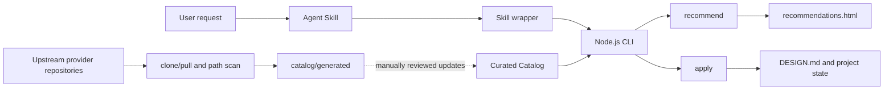

# Implementation and Open-Source Integration

This document explains how AI UI Style Director combines an agent workflow, deterministic recommendation, visual previews, project design contracts, and upstream open-source material.

It is not a frontend component aggregator and does not automatically install components into a target project. Its job is to complete three steps before UI code is written:

1. match a project brief to comparable visual directions;
2. let the user choose through SVG cards, an HTML gallery, and external references;
3. lock the selected direction into a project `DESIGN.md` and machine-readable state.

## Runtime architecture



Runtime recommendation and upstream synchronization are deliberately separate. Recommendations read reviewed Catalog data; provider refreshes generate source indexes but never change recommendation behavior automatically.

## Entrypoints and call path

### 1. Agent Skill: control when UI implementation may begin

`skills/web-style-director/SKILL.md` is the workflow entrypoint for coding agents such as Codex and Claude Code. It requires the agent to gather missing context, present five directions, support rerolling with `--again`, run `apply` after selection, and wait for first-viewport confirmation before writing UI code.

The Skill defines behavior and gates. It does not contain the recommendation algorithm.

### 2. Skill wrapper: locate the real CLI

`skills/web-style-director/scripts/style-director.mjs` searches `AI_UI_STYLE_DIRECTOR_HOME`, the in-repository layout, Codex and Claude Code tool directories, and compatible skill asset layouts. It then starts `bin/ai-ui-style-director.mjs` with the current Node.js executable while forwarding arguments and the working directory.

This lets multiple agents share the same core implementation without requiring the same installation layout.

### 3. CLI: parse arguments and dispatch commands

`bin/ai-ui-style-director.mjs` is a thin command layer over `src/core.mjs`.

| Command | Responsibility |
| --- | --- |
| `questions` | Return intake questions for an underspecified brief |
| `recommend` | Rank directions, update session state, and generate an HTML gallery |
| `preview` | Inspect or open the most recent gallery |
| `apply` | Generate the project design contract and state files |
| `sync` | Clone or update configured provider repositories |
| `refresh-catalog` | Scan providers and rebuild source indexes |

`update` is a compatibility alias for `refresh-catalog`; it does not update an installed copy of the tool.

## Catalog: the runtime knowledge source

Runtime behavior reads four curated datasets:

| File | Purpose |
| --- | --- |
| `catalog/style-profiles.json` | Page types, audiences, goals, density, tone, layout, palette, and component suggestions |
| `catalog/style-visuals.json` | SVG variants, theme colors, and real-reference slugs |
| `catalog/component-kits.json` | Component-library fit and usage boundaries |
| `catalog/scenario-questions.json` | Questions for an underspecified brief |

`catalog/providers.json` describes upstream repositories. `catalog/generated/*` records scan results. The recommendation core does not read those generated indexes, so upstream changes cannot enter user-facing recommendations without review.

## Recommendation algorithm

Recommendation in `src/core.mjs` is deterministic rule matching. It does not require an LLM, embeddings, or a vector database.

### Brief normalization

`normalizeBrief` expands common Chinese scenario terms into English keywords, lowercases the input, removes non-alphanumeric characters, and normalizes whitespace. `isBriefInsufficient` requires at least one recognized product or page scenario before ranking profiles.

### Weighted scoring

Profile fields use three weight groups:

- high: keywords, page types, audiences, and goals;
- medium: tones, density, and best-fit scenarios;
- low: layout rules.

Common intents such as AI, dashboard, developer, enterprise, consumer, and redesign receive explicit bonuses. Identical inputs and Catalog data produce identical ordering, which keeps recommendation testable and reproducible.

### Diversification and rerolling

`diversify` first selects high-scoring profiles from different `family` values, then fills remaining slots from the score order. This prevents five near-identical options.

Session state lives in `.ui-style-director/session.json`. With `--again`, the core excludes `shownStyleIds` and appends the next results. It reports `exhausted` when fewer unseen styles remain than requested.

## Visual previews and recommendation galleries

### SVG previews

`src/preview.mjs` renders normalized visual metadata into deterministic SVG wireframes. Each `variant` represents a page structure such as an app shell, dashboard, docs, commerce, or portfolio.

`scripts/generate-style-previews.mjs` generates `catalog/previews/*.svg` for every profile. Its `--check` mode verifies committed previews without writing files.

### Per-recommendation HTML gallery

After a successful recommendation, `writeRecommendationGallery` writes `.ui-style-director/recommendations.html` next to the session file:

- all five SVG cards are embedded as data URIs;
- CSS, localized copy, and result data are stored in one file;
- upstream Light/Dark previews remain external links;
- `preview --open` selects `rundll32.exe`, `open`, or `xdg-open` for the current platform.

The gallery itself works offline. Network access is only needed to visit upstream references.

## `apply` and the project design contract

After selection, `applyStyle` writes:

```text
DESIGN.md
.ui-style-director/
  first-viewport-draft.svg
  selected-style.json
  recommended-components.json
  source-attribution.json
```

`DESIGN.md` records source intent, project brief, visual references, first viewport, layout rules, color roles, typography, component guidance, risks, and implementation constraints. The JSON files provide structured state for later agents and automation.

An existing `DESIGN.md` is protected by default and is replaced only when `--force` is supplied.

## How open-source projects are integrated

Open-source material is connected through provider metadata and an adapter-like synchronization pipeline, not declared as runtime npm dependencies.

| Provider | Role | Integration |
| --- | --- | --- |
| `VoltAgent/awesome-design-md` | Style-reference corpus | Scan `DESIGN.md`, curate profiles, and expand slugs into external Light/Dark previews |
| `Harzva/design-md-flow` | Workflow reference | Track source and revision while implementing a local selection gate |
| `shadcn-ui/ui` | Base components | Scan registry sources and recommend the kit from matching profiles |
| `shadcn/originui` | Application and marketing blocks | Scan registry sources and map the kit to practical SaaS surfaces |
| `magicuidesign/magicui` | Motion-rich marketing components | Use as both a motion direction source and an optional component kit |
| `tremorlabs/tremor` | Dashboards and charts | Use as both a data-heavy direction source and an optional component kit |

A component-kit selection only adds guidance to recommendation output and `DESIGN.md`. Installation, copying, or code generation remains the responsibility of the target-project agent, which must account for framework, version, license, and user constraints.

## Provider refresh and source indexes

`syncProviders` shallow-clones missing repositories, fast-forward pulls existing caches, and writes `providers-lock.json` with status and cache locations.

`updateCatalog` then recursively scans each cache while ignoring Git metadata, dependencies, build outputs, and cache directories. It records revisions, branches, `DESIGN.md` paths, registry paths, and documentation paths in:

```text
catalog/generated/provider-inventory.json
catalog/generated/style-sources.json
catalog/generated/component-sources.json
```

The scanner is a lightweight path indexer, not a semantic component parser. It records at most 200 registry files and 100 documentation files per provider, so counts represent indexed sources rather than complete upstream component totals.

`.github/workflows/refresh-providers.yml` runs the same process daily, validates the repository, and opens a pull request only when generated indexes change.

## Dependency and license boundaries

The project has no runtime npm dependencies. The core uses Node.js built-ins and the external Git command. `actions/checkout`, `actions/setup-node`, and `gh` are limited to CI and maintenance automation.

Provider use follows explicit boundaries:

- upstream HTML, screenshots, logos, and brand assets are not vendored;
- local SVG cards are independently generated brand-neutral wireframes;
- external previews are comparison references only;
- target projects must re-check licenses and preserve required notices before adopting component code;
- a component library must not override the visual direction already confirmed by the user.

See `THIRD_PARTY_NOTICES.md` and `docs/PROVIDERS.md` for the source and license policy.

## Current architectural trade-offs

The implementation favors explainability, reproducibility, and a small dependency surface:

- strengths: offline operation, straightforward tests, traceable recommendations, and reviewed upstream changes;
- cost: semantic understanding is limited by keywords and curated profiles;
- maintenance: new providers still require reviewed profile, visual, and component mappings;
- extension requirement: future recommendation entrypoints should reuse or verify the same scoring and diversification rules so different surfaces stay consistent.

Tests cover intake checks, recommendation order, rerolling, visual references, the HTML gallery, `apply` output, provider indexes, CLI commands, and Codex/Claude Code wrapper discovery.
