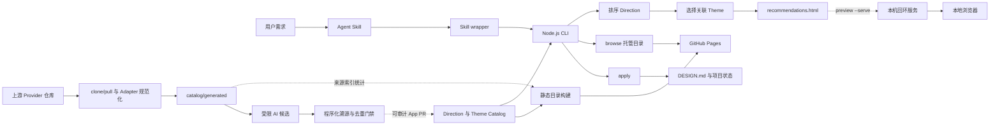

# 实现详解与开源集成

本文从代码角度说明 AI UI Style Director 如何把 Agent 工作流、确定性推荐、视觉预览、项目设计契约和上游开源资料组合在一起。

它不是一个前端组件库聚合包，也不会在目标项目中自动安装组件。它的核心职责是在编写 UI 代码前完成三件事：

1. 把项目 brief 匹配到一组可比较的视觉方向；
2. 让用户通过 SVG 卡片、HTML 画廊和外部参考完成选择；
3. 把选定 Direction 和 Theme 固化成项目内的 `DESIGN.md` 与机器可读状态。

## 运行架构



系统刻意把运行时推荐和上游同步分开。推荐只读取已审查的 Catalog；Provider
刷新只生成来源索引。独立的 AI 辅助 Workflow 可以提出候选，但只有程序门禁和
受保护 PR 合并后才会改变推荐结果。运行时 Catalog 从 12 个 family、每组 4 个
方向的审查基线开始，并可继续增长；生成索引当前包含 7 个 Provider、109 条
style source 和 600 条 component source。原有 74 条 `DESIGN.md` 来源是 baseline，
新增 35 条 daisyUI theme CSS 来源从 pending 开始，二者都不能按路径数量直接等同于
可推荐风格。

## 入口与调用链

### 1. Agent Skill：控制什么时候可以写 UI

`skills/web-style-director/SKILL.md` 是面向 Codex、Claude Code 等编程 Agent 的流程入口。它规定：

- 信息不足时只追问必要上下文；
- 默认展示五个 Direction/Theme 结果；
- 用户不满意时使用 `--again` 排除本会话已展示的 Direction；
- 用户选定后用 Direction 和 Theme 两个 ID 执行 `apply`；
- 用户确认首屏草图之前不编写 UI 代码。

Skill 负责流程和行为约束，不包含推荐算法。

明确的 `browse`、旧 `serve` 或完整目录浏览需求会通过
`references/catalog-browser.md` 进入独立的顶层路由。Agent 只打开 Pages 托管地址，
不会收集网站 brief、推荐五个 Direction/Theme 结果、运行 `apply` 或修改目标项目。

### 2. Skill wrapper：定位真正的 CLI

`skills/web-style-director/scripts/style-director.mjs` 是轻量转发器。它会从以下位置寻找仓库：

- `AI_UI_STYLE_DIRECTOR_HOME`；
- 当前 skill 所在仓库；
- Codex 的 `~/.codex/tools/ai-ui-style-director`；
- Claude Code 的 tools 目录；
- 兼容的 skill assets 目录。

定位到仓库后，wrapper 使用当前 Node.js 进程启动 `bin/ai-ui-style-director.mjs`，并原样转发参数与工作目录。这样不同 Agent 可以共用同一套核心代码，同时保持各自的安装布局。

### 3. CLI：参数解析和命令分发

`bin/ai-ui-style-director.mjs` 是薄命令层。推荐、项目契约、预览和 Provider
操作会分发到 `src/core.mjs`；完整目录命令从
`src/catalog-browser.mjs` 的 `hostedCatalogInfo` 获取带 revision 的 Pages 地址。主要命令为：

| 命令 | 职责 |
| --- | --- |
| `questions` | 输出 brief 缺失时的场景问题 |
| `recommend` | 排序 Direction、选择关联 Theme、写入会话并生成 HTML 画廊 |
| `browse` | 打开支持搜索和标签过滤的托管目录 |
| `serve` | `browse` 的兼容别名 |
| `preview` | 查看或打开某一次生成的推荐画廊 |
| `apply` | 生成项目设计契约和状态文件 |
| `sync` | 克隆或更新配置的 Provider 仓库 |
| `refresh-catalog` | 扫描 Provider 并重建来源索引 |

`update` 只是 `refresh-catalog` 的兼容别名，不负责更新已安装的工具。

### 4. 目录浏览器与静态 Pages 构建

`src/catalog-browser.mjs` 提供目录模型与浏览器资源：

- `buildStyleCatalog`：把规范 Direction、关联 Theme、生成式 SVG 预览 URL、
  索引、来源索引统计及确定性的 revision 组合成 schema v5 浏览器视图模型；
- `buildBalancedCatalogEntryOrder`：不改变规范条目顺序，按六种体验类型生成稳定的
  数字轮转顺序；
- `hostedCatalogInfo`：把本地预期 revision 附在 Pages 地址上，并返回 CLI
  所需信息；
- `searchCatalogEntries`：使用倒排索引查询候选风格，并在必要时做子串回退；
- `filterCatalogEntries`：把搜索结果与体验类型、family、页面类型、密度、调性和
  组件库过滤组合；
- `renderCatalogBrowserPage`：渲染浏览器页面外壳；
- `buildStyleCatalogStaticAssets`：组装所有可部署的静态文件。

`scripts/build-catalog-site.mjs` 把这些资源写入 `dist/pages`。`catalog.json`、
`styles.css`、规范路径 `previews/v2/<direction-id>/<theme-id>.svg` 以及兼容路径
`previews/<legacy-style-id>.svg` 都使用相对引用，因此能在 GitHub 项目子路径下
正确工作。页面状态编码在 URL query 中，因此筛选结果无需服务端状态即可在
刷新后保留。
Facet URL 只保存 `tag=experienceType:consumer-app` 这类受治理 ID，中英文标签与
别名不会成为 URL 身份。目录载入后会清除未知值，同时保留 `expectedRevision`
等无关参数。

浏览器模型包含词项到数字条目下标的 postings 索引，以及 ID 到条目的索引。
数字 postings 避免在搜索索引里重复存储风格 ID。多词查询对精确 postings 求
交集；精确词项未命中时回退到子串匹配，使部分词仍然可搜。客户端每次渲染
24 张匹配 Direction 卡片，限制首屏 DOM 与图片开销，但不会改变全部匹配数量。
没有搜索和 Facet 时，它使用构建期体验类型轮转；当前首批 24 张每类各 4 张。
搜索或任何 Facet 激活后，仍使用规范/搜索索引顺序。

HTML 与 JSON 都携带 `catalogRevision`，CLI 还会把本地预期 revision 附到托管
URL 上；三者不一致时页面显示提示，但继续允许搜索和过滤。
`.github/workflows/pages.yml` 会在 PR 中构建，并在 `main` 上上传静态产物、通过
GitHub Pages environment 部署。

`src/loopback-server.mjs` 只继续负责项目级 `preview --serve` 的
`127.0.0.1` listener。目录 server helper 仅用于测试和本地静态站点验收，不再
作为面向用户的 CLI 入口。

## Catalog：真正的运行时知识源

推荐、浏览和项目契约运行时读取规范 v2 投影：

| 文件 | 用途 |
| --- | --- |
| `catalog/style-directions.json` | Direction 的结构、意图、密度、字体和组件建议 |
| `catalog/style-themes.json` | 可复用 Theme token、appearance 与 Theme 来源 |
| `catalog/style-direction-themes.json` | 允许的 Direction/Theme 组合，以及每个 Direction 的默认 Theme |
| `catalog/style-preview-specs.json` | 布局原型、内容模式、区块和层级 |
| `catalog/style-aliases.json` | legacy 风格 ID 到历史 Direction/Theme 选择的映射 |
| `catalog/component-kits.json` | 组件库适用场景与使用边界 |
| `catalog/scenario-questions.json` | brief 信息不足时的问题 |

`style-profiles.json`、`style-visuals.json`、已提交的旧预览和不可变记录继续保留，
用于审计与兼容。当前 v2 快照包含 57 个 Direction 和 77 个已关联 Theme 选择；
这两个数字都不是配置上限。独立的 `catalog/recommendation-benchmarks.json`
用于保护 family 与体验类型意图覆盖及相关性护栏。

`catalog/providers.json` 描述上游仓库；`catalog/generated/*` 记录上游扫描结果。
推荐核心不会直接读取生成索引，因此上游内容变化不能直接进入用户推荐。供给侧
Curator 只读取新来源或变化哈希并创建受治理 PR；消费侧仍只读取已合并的规范
Catalog 数据。

目录浏览器读取 `catalog/generated/style-sources.json` 的唯一目的是显示当前
来源索引数量。生成索引当前包含 7 个 Provider、109 条 style source 和 600 条
component source，但 109 条风格路径不会作为完整 Direction 卡片返回。浏览器
条目来自经过审查的 Direction/Theme 投影。托管浏览器 payload 使用 schema v5，
与生成 Provider 索引的 schema 版本彼此独立。

## 推荐算法

`src/core.mjs` 中的推荐是确定性程序匹配，不依赖 LLM、Embedding 或向量
数据库。Agent Skill 负责收集 brief、调用 CLI、展示结果和等待选择，但不会
凭主观判断重排风格。

### Brief 标准化

`normalizeBrief` 会：

- 将中文场景词补充为对应英文关键词，例如“后台”扩展为 dashboard、admin 和 internal-tool；
- 从共享体验 taxonomy 派生中英文意图，可识别“C 端”/`consumer app`、
  “B 端”/`B2B`、“管理台”/`admin console` 等写法；
- 转为小写；
- 去除非字母数字字符并压缩空格；
- 对简单英文复数做规范化，并过滤 product、website、team 等缺乏场景区分度
  的通用词。

`isBriefInsufficient` 把显式体验类型视为有效场景信号；否则从当前 Catalog 的
family、页面类型、受众、目标、关键词和适用场景动态派生可识别词表。brief 没有
任何场景信号时返回问题列表，不进行猜测性推荐。

### 加权评分

Direction 字段按三档参与词项匹配：

- 高权重：family、关键词、页面类型、受众和目标；
- 中权重：调性、密度和适用场景；
- 低权重：布局规则。

页面类型、受众、目标、关键词和 family 的完整短语还会获得额外权重；
`redesign` 与 `new landing` 保留少量明确的场景加分。匹配采用词边界而不是任意
子串，并把 `docs` 与 `documentation` 等受治理语义别名归一到同一词项。
brief 显式指定体验类型时，匹配 Direction 只获得一次固定加分；同一类型命中多个
别名不会重复累计。“内容”“文档”、`B2B`、`dashboard` 等主题、受众或页面词仍按
普通字段参与加权；只有“C 端应用”“营销官网”“管理系统”“管理台”等明确界面
形态才触发固定体验类型加分。
分数相同时按名称和 ID 稳定排序，因此相同输入和 Catalog 会得到相同的
ID、分数和顺序。

只有在 Direction 排名完成后，`selectThemeForDirection` 才会用同一 brief 为其
关联 Theme 评分。稳定并列时优先默认关联，再按 Theme ID 排序。这个第二阶段只
选择展示 token，不会改变 Direction 分数、差异化结果或顺序。

### 差异化与换一批

`diversifyScoredProfiles` 先移除零分结果，并只保留达到最高分 15% 相关性阈值
的方向；Top 1 永远不移动。后续每个位置依次把“未出现的 `experienceType`”、
“未出现的 `family`”和“低于 60% 软占比目标的 family”作为软偏好。候选只有同时
达到当前最佳剩余分数的 80% 和原始 Top 1 的 50%，才能被提前。

这里没有体验类型硬配额，family 的 60% 也不再预先淘汰候选。因此单一类别确实
明显更相关时，Top 5 可以保持单一类别；只有近分候选才参与差异化。

schema v2 的 12 场景 benchmark 同时断言 Top 1/Top 5 的 family 与体验类型覆盖；
六种体验类型各有至少一个单值 Top 1 场景。测试还锁定原始 Top 1，并确保任何
入选低分项都不会越过分数高出 25% 以上的未入选候选，最后校验重复运行的 ID、
体验类型和分数完全一致。

会话状态保存在 `.ui-style-director/session.json`。schema v2 保存
`shownDirectionIds` 和上一次的 Direction/Theme 选择。使用 `--again` 时，核心
排除已展示 Direction。legacy `shownStyleIds` 仍可读取并通过 alias 解析；写入
v2 状态时也保留该兼容字段。未展示 Direction 不足时返回 `exhausted`。

## 视觉预览和推荐画廊

### SVG 预览

`src/preview.mjs` 根据 Direction、PreviewSpec 和 Theme token 渲染确定性的 SVG
线框。布局原型控制外层骨架，内容模式、区块和层级控制可见模块；只更换 Theme
时结构保持不变。

`scripts/generate-style-previews.mjs` 保留并验证全部已提交的 legacy
`catalog/previews/*.svg`，再在内存中渲染所有已关联 Direction/Theme 组合，执行
确定性完整性检查。

### 每次推荐生成的 HTML

推荐成功后，`writeRecommendationGallery` 在 session 文件旁写入 `.ui-style-director/recommendations.html`：

- 五张 SVG 会编码为 data URI；
- Direction/Theme 的 ID、名称、CSS、本地化文案和渲染后的结果数据会保存在
  同一文件中；机器可读推荐输出另行携带 Theme appearance 与 tokens；
- Light/Dark 上游预览仍然是外部链接；
- `preview --open` 根据平台调用 `rundll32.exe`、`open` 或 `xdg-open`；
- `preview --serve` 在 `127.0.0.1` 启动一个禁用缓存的前台 HTTP 服务，
  使用可用端口且只提供指定画廊。

因此画廊和本地服务都可以离线使用，只有访问上游参考时需要网络。按 Ctrl+C
即可停止服务。

### 完整目录浏览器

`browse` 不创建推荐 session，也不写入项目文件。它会输出带 revision 的
GitHub Pages 地址，按需自动打开，然后立即返回。`--json` 输出托管地址、
revision、Direction、Theme、关联和来源数量，以及打开状态。`serve` 保留为带
迁移提示的兼容别名；两者都不接受 `--port`。

客户端从相对路径 `catalog.json` 读取经过审查的 schema v5 Direction/Theme
视图模型，用倒排索引和标签执行搜索与过滤。它每批渐进渲染 24 张匹配的
Direction 卡片，并在卡片内切换关联 Theme，而不是复制卡片。生成预览从同源
相对路径 `previews/v2/<direction-id>/<theme-id>.svg` 加载；兼容的 legacy 资源
仍位于 `previews/<legacy-style-id>.svg`。当前 57 个 Direction 和 77 个关联只是
快照，不是上限。
无筛选首批使用 Catalog 中经过校验的数字体验类型轮转顺序；搜索与 Facet 结果
继续使用规范/搜索索引顺序。

## Catalog 质量门禁与推荐基准

`scripts/validate-curated-catalog.mjs` 同时提供可导入的
`validateCuratedCatalog` 和命令行入口。它会验证：

- `catalog/curation-policy.json` 要求的 12 个基线 family 各至少有 4 个 profile
  和 3 种 visual variant；
- profile ID 与 visual `styleId` 唯一且一一对应；
- 必填字符串、数组与 kebab-case taxonomy 合法且无重复项；
- visual 使用支持的变体，并提供完整且合法的语义颜色；
- 每个方向恰好包含 3 条不重复的参考，且 provider/slug 确实存在于来源索引；
- 每个 visual 都有对应的已提交 SVG。

运行 `npm run catalog:curated:validate` 可单独执行该门禁；`npm run check` 会在
完整检查链中自动执行它。`catalog/recommendation-benchmarks.json` 还保存 schema v2 的 12 个
覆盖 developer、SaaS、enterprise、dashboard、docs、launch、consumer、
portfolio、commerce、research、finance 和 education 的场景。测试会逐项校验
Top 1/Top 5 的 family 与体验类型、相关性护栏，以及重复运行得到完全相同的
ID、体验类型和分数。

## `apply` 与项目设计契约

规范推荐流程会把 Direction ID 和 Theme ID 一并传给 `applyStyle`。直接使用
CLI 并省略 Theme 时，legacy 风格 ID 会优先通过 alias 恢复历史组合；只有不与
legacy alias 同名的规范 Direction ID 才使用声明的默认 Theme。选择后，
`applyStyle` 会在目标项目写入：

```text
DESIGN.md
.ui-style-director/
  first-viewport-draft.svg
  selected-style.json
  recommended-components.json
  source-attribution.json
```

v2 `DESIGN.md`、`selected-style.json` 和 `source-attribution.json` 保持两层独立
信息：Direction 结构、PreviewSpec 与 Direction 参考；Theme appearance、token
与 Theme 来源。两个 ID 也会写入项目草图。JSON 文件为后续 Agent 或自动化提供
结构化状态。

如果目标项目已经存在 `DESIGN.md`，默认会拒绝覆盖；只有显式传入 `--force` 才会替换。

## 开源项目如何接入

项目通过 Provider 元数据和显式 Source Adapter 接入开源资料，而不是把这些仓库声明成 npm 依赖。

| 上游仓库 | 系统中的角色 | 接入方式 |
| --- | --- | --- |
| `VoltAgent/awesome-design-md` | 风格参考语料 | 扫描并哈希 `DESIGN.md`，保留旧预览 URL，并把变化来源交给受治理策展 |
| `saadeghi/daisyui` | 主题 token 参考语料 | 配置为 `daisyui-themes` Provider，解析 35 个限定主题 CSS，确定性转换 OKLCH，并把规范主题 JSON 交给受治理策展 |
| `Harzva/design-md-flow` | 工作流参考 | 登记来源和版本；本地 Skill 实现自己的选择门禁 |
| `shadcn-ui/ui` | 基础组件 | 扫描 registry，并作为 profile 的可选组件建议 |
| `shadcn/originui` | 应用与营销区块 | 扫描 registry，映射到适合 SaaS 和重复页面的 component kit |
| `magicuidesign/magicui` | 动效营销组件 | 作为动效方向的来源和可选 component kit |
| `tremorlabs/tremor` | Dashboard 与图表 | 作为数据密集方向的来源和可选 component kit |

选择某个 component kit 只会把使用建议写入推荐结果和 `DESIGN.md`。真正安装、复制或生成组件，仍由目标项目的 Agent 根据框架、版本、许可证和用户约束决定。

## Provider 刷新与来源索引

`syncProviders` 对每个 Provider 执行：

- 缓存不存在时使用 `git clone --depth 1`；
- 缓存存在时使用 `git pull --ff-only`；
- 写入包含同步状态和缓存位置的 `providers-lock.json`。

`updateCatalog` 随后递归扫描缓存，跳过 `.git`、`node_modules`、构建产物和缓存目录。
每个 Provider Adapter 负责发现自己的 style source 并生成用于哈希的规范内容；刷新还会记录：

- commit revision 和 branch；
- style-source 路径与类型；
- registry 文件路径；
- docs 文件路径。

输出文件为：

```text
catalog/generated/provider-inventory.json
catalog/generated/style-sources.json
catalog/generated/component-sources.json
```

生成 Provider 索引使用 schema v4：仓库级来源信息统一保存在
`provider-inventory.json`，每个 Provider 的仓库与 commit revision 只记录一次；
style-source 索引保存 `providerId`、`path`、`sourceType` 和规范化
`contentHash`，component-source 保持前三个字段。版本控制中的生成产物不再
写入生成时间和本机缓存绝对路径，因此相同的上游输入会得到字节完全一致的文件，
不会产生无意义的刷新 PR。扫描器会先固定目录项顺序，再截取受上限约束的来源集合，
保证 Windows、Linux 及不同文件系统得到相同的索引子集。

扫描器是轻量路径索引器，不解析组件语义。它会索引所有匹配的 `DESIGN.md`；格式
专用的 `daisyui-theme-css` Adapter 只额外索引
`packages/daisyui/src/themes/*.css`，解析受治理 token、确定性转换 OKLCH，并输出同时
用于哈希与策展模型输入的规范 JSON。用户可选风格数量不受扫描器常量限制；registry
与 docs 仍分别保留每个 Provider 200 和 100 个文件的维护性上限。当前 109 条 style
source 中，原有 74 条是 baseline，35 条 daisyUI 主题则从 pending 开始，不会直接晋升。

daisyUI Normalizer 是严格的 Schema 边界：只接受精确 29 个声明（1 个
`color-scheme`、20 个颜色值和 8 个几何值），未知、缺失、重复或格式非法的输入都会
被拒绝。因此上游 token 契约发生变化时，必须走人工审查的 Normalizer 版本/代码
变更，不能由刷新过程猜测。`canonicalTheme.accent` 映射自代表主导品牌色/行动色的
daisyUI `--color-primary`，上游自己的 accent token 仍完整保留在规范颜色表中。任一
受治理值变化都会生成新的规范内容哈希，因此相同 `providerId + path` 会因为与上一版
state 哈希不同而重新进入 pending。

`.github/workflows/refresh-providers.yml` 每天运行相同流程，执行仓库检查，并只在生成索引变化时创建 PR。

正常刷新路径无人值守，但不会绕过 `main` 保护。仅限本仓库的 GitHub App
负责推送自动化分支并创建 PR，使 PR CI 不再进入 `GITHUB_TOKEN` 创建 PR 时的
人工批准状态。工作流随后请求 GitHub 原生 squash auto-merge，所有必需检查仍须
通过。CI 会拒绝修改三个生成目录文件以外内容的自动化分支；检查失败时 PR 保持
打开等待异常处理，成功时则保留 Action 运行、PR diff、CI 日志和合并提交作为
审计记录。配置与运维方式参见
[`AUTOMATED_REFRESH.zh-CN.md`](AUTOMATED_REFRESH.zh-CN.md)。

`.github/workflows/curate-style-sources.yml` 会在另一条流程中处理新来源或变化哈希，
依次经过 OpenAI-compatible 客户端、确定性门禁、不可变记录、独立文件白名单和
另一条由 App 创建的 Draft PR。这条流程绝不开启 auto-merge，而是由维护者
人工审查并手动合并提案。详见
[`AUTOMATED_CURATION.zh-CN.md`](AUTOMATED_CURATION.zh-CN.md)。

当前仓库的不可变策展记录文件为 0；74 条 baseline 游标也没有 record ID。因此，
`style-curation-v3` 扩展 record ID 哈希输入后，无需重新生成仓库内记录。若外部部署
已经存在 v2 不可变记录，升级时必须保留原文件与 ID：先增加显式的版本感知迁移/
校验逻辑，让旧记录与新 v3 事件并存，再以追加方式写入新记录；绝不能重新计算或
覆盖既有 v2 审计历史。

## 依赖与许可证边界

项目没有运行时 npm 依赖，核心仅使用 Node.js 内置模块和外部 Git 命令。GitHub Actions 中的 `actions/checkout`、`actions/setup-node` 与 `gh` 只服务于 CI 和维护自动化。

Provider 内容的使用遵循以下边界：

- 不把上游 HTML、截图、logo 或品牌资产提交到本仓库；
- 本地 SVG 是根据标准化元数据独立生成的无品牌草图；
- 外部预览只用于比较视觉语言；
- 在目标项目中采用组件代码前重新检查对应许可证并保留必要声明；
- 组件库不能反过来覆盖用户已经确认的视觉方向。

详见 `THIRD_PARTY_NOTICES.md` 和 `docs/PROVIDERS.zh-CN.md`。

## 当前架构取舍

这套实现优先选择可解释、可复现和低依赖：

- 优点：消费侧离线可用、容易测试、推荐理由可追踪、上游更新有完整审计；
- 代价：供给侧语义策展需要模型凭证，消费侧匹配仍基于关键词和 Profile；
- 维护要求：新增 `DESIGN.md` Provider 只需配置；新增来源格式需提供经过审查的
  Adapter（例如 `daisyui-theme-css`），新增 taxonomy 仍需政策变更；
- 扩展要求：如果未来增加新的推荐入口，应复用或验证同一套评分与差异化规则，避免不同入口产生不一致结果。

仓库测试覆盖 brief 检查、12 场景推荐基准、换一批、Catalog 结构校验、视觉
引用、HTML 画廊、倒排搜索与子串回退、24 张一批的目录渲染、独立 SVG HTTP
路由、通用回环安全、`apply` 产物、Provider 索引、CLI 命令以及
Source Hash 与 Adapter、Mock OpenAI-compatible 响应、策展 state/审计门禁、
Workflow 白名单以及 Codex/Claude Code wrapper 路径发现。
