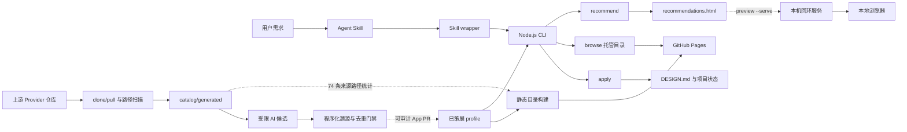

# 实现详解与开源集成

本文从代码角度说明 AI UI Style Director 如何把 Agent 工作流、确定性推荐、视觉预览、项目设计契约和上游开源资料组合在一起。

它不是一个前端组件库聚合包，也不会在目标项目中自动安装组件。它的核心职责是在编写 UI 代码前完成三件事：

1. 把项目 brief 匹配到一组可比较的视觉方向；
2. 让用户通过 SVG 卡片、HTML 画廊和外部参考完成选择；
3. 把选定方向固化成项目内的 `DESIGN.md` 与机器可读状态。

## 运行架构



系统刻意把运行时推荐和上游同步分开。推荐只读取已审查的 Catalog；Provider
刷新只生成来源索引。独立的 AI 辅助 Workflow 可以提出候选，但只有程序门禁和
受保护 PR 合并后才会改变推荐结果。运行时 Catalog 从 12 个 family、每组 4 个
方向的审查基线开始，并可继续增长；生成索引中的 74 条 style source 已作为 baseline
提交，不能按数量等同于可推荐风格。

## 入口与调用链

### 1. Agent Skill：控制什么时候可以写 UI

`skills/web-style-director/SKILL.md` 是面向 Codex、Claude Code 等编程 Agent 的流程入口。它规定：

- 信息不足时只追问必要上下文；
- 默认展示五个方向；
- 用户不满意时使用 `--again` 排除本会话已展示的方向；
- 用户选定后执行 `apply`；
- 用户确认首屏草图之前不编写 UI 代码。

Skill 负责流程和行为约束，不包含推荐算法。

明确的 `browse`、旧 `serve` 或完整目录浏览需求会通过
`references/catalog-browser.md` 进入独立的顶层路由。Agent 只打开 Pages 托管地址，
不会收集网站 brief、推荐五个风格、运行 `apply` 或修改目标项目。

### 2. Skill wrapper：定位真正的 CLI

`skills/web-style-director/scripts/style-director.mjs` 是轻量转发器。它会从以下位置寻找仓库：

- `AI_UI_STYLE_DIRECTOR_HOME`；
- 当前 skill 所在仓库；
- Codex 的 `~/.codex/tools/ai-ui-style-director`；
- Claude Code 的 tools 目录；
- 兼容的 skill assets 目录。

定位到仓库后，wrapper 使用当前 Node.js 进程启动 `bin/ai-ui-style-director.mjs`，并原样转发参数与工作目录。这样不同 Agent 可以共用同一套核心代码，同时保持各自的安装布局。

### 3. CLI：参数解析和命令分发

`bin/ai-ui-style-director.mjs` 是薄命令层。推荐、项目契约、预览和 Provider
操作会分发到 `src/core.mjs`；完整目录命令从
`src/catalog-browser.mjs` 的 `hostedCatalogInfo` 获取带 revision 的 Pages 地址。主要命令为：

| 命令 | 职责 |
| --- | --- |
| `questions` | 输出 brief 缺失时的场景问题 |
| `recommend` | 推荐方向、写入会话并生成 HTML 画廊 |
| `browse` | 打开支持搜索和标签过滤的托管目录 |
| `serve` | `browse` 的兼容别名 |
| `preview` | 查看或打开某一次生成的推荐画廊 |
| `apply` | 生成项目设计契约和状态文件 |
| `sync` | 克隆或更新配置的 Provider 仓库 |
| `refresh-catalog` | 扫描 Provider 并重建来源索引 |

`update` 只是 `refresh-catalog` 的兼容别名，不负责更新已安装的工具。

### 4. 目录浏览器与静态 Pages 构建

`src/catalog-browser.mjs` 提供目录模型与浏览器资源：

- `buildStyleCatalog`：把已策展 profile、视觉元数据、生成式 SVG 预览和
  来源索引统计及确定性的 revision 组合成 schema v3 浏览器视图模型；
- `hostedCatalogInfo`：把本地预期 revision 附在 Pages 地址上，并返回 CLI
  所需信息；
- `searchCatalogEntries`：使用倒排索引查询候选风格，并在必要时做子串回退；
- `filterCatalogEntries`：把搜索结果与 family、页面类型、密度、调性和
  组件库过滤组合；
- `renderCatalogBrowserPage`：渲染浏览器页面外壳；
- `buildStyleCatalogStaticAssets`：组装所有可部署的静态文件。

`scripts/build-catalog-site.mjs` 把这些资源写入 `dist/pages`。HTML 使用
`catalog.json`、`styles.css` 和 `previews/<style-id>.svg` 等相对引用，因此能
在 GitHub 项目子路径下正确工作。页面状态编码在 URL query 中，因此筛选结果
无需服务端状态即可在刷新后保留。

`catalog.json` 使用 schema v3。条目不再内嵌 SVG data URI，只携带轻量的
`previewUrl`；响应中的 `entryIndex` 支持按 ID 定位条目，`searchIndex` 则把
标准化词项映射到有序数字条目下标 postings。多词查询对精确 postings 求交集，
未知或前缀词回退到 `searchText` 子串匹配，兼顾常见查询速度和宽松搜索体验。
客户端每次最多追加 24 张卡片；搜索、过滤或清空条件会重置分页，但状态栏
始终显示全部匹配数量。

HTML 与 JSON 都携带 `catalogRevision`，CLI 还会把本地预期 revision 附到托管
URL 上；三者不一致时页面显示提示，但继续允许搜索和过滤。
`.github/workflows/pages.yml` 会在 PR 中构建，并在 `main` 上上传静态产物、通过
GitHub Pages environment 部署。

`src/loopback-server.mjs` 只继续负责项目级 `preview --serve` 的
`127.0.0.1` listener。目录 server helper 仅用于测试和本地静态站点验收，不再
作为面向用户的 CLI 入口。

## Catalog：真正的运行时知识源

推荐与项目契约运行时读取四组已策展数据：

| 文件 | 用途 |
| --- | --- |
| `catalog/style-profiles.json` | 页面类型、受众、目标、密度、调性、布局、配色和组件建议 |
| `catalog/style-visuals.json` | SVG 变体、主题色和真实视觉参考 slug |
| `catalog/component-kits.json` | 组件库适用场景与使用边界 |
| `catalog/scenario-questions.json` | brief 信息不足时的问题 |

`catalog/providers.json` 描述上游仓库；`catalog/generated/*` 记录上游扫描结果。
推荐核心不会直接读取生成索引，因此上游内容变化不能直接进入用户推荐。供给侧
Curator 只读取新来源或变化哈希并创建受治理 PR；消费侧仍只读取已合并的 Profile。

`style-profiles.json` 与 `style-visuals.json` 始终一一对应；初始基线覆盖 12 个
family、每组 4 个方向。`style-sources.json` 当前有 74 条 provider
路径；它们没有完整的适用场景、风险、视觉主题和经过审查的参考关系，因此不
会自动晋升为 profile。

目录浏览器读取 `catalog/generated/style-sources.json` 的唯一目的是显示当前
来源索引数量。里面的 74 条路径不会被语义解析，也不会作为完整风格卡片返回；
浏览器条目仍然只来自 `catalog/style-profiles.json` 中经过审查的 profile。

## 推荐算法

`src/core.mjs` 中的推荐是确定性程序匹配，不依赖 LLM、Embedding 或向量
数据库。Agent Skill 负责收集 brief、调用 CLI、展示结果和等待选择，但不会
凭主观判断重排风格。

### Brief 标准化

`normalizeBrief` 会：

- 将中文场景词补充为对应英文关键词，例如“后台”扩展为 dashboard、admin 和 internal-tool；
- 转为小写；
- 去除非字母数字字符并压缩空格；
- 对简单英文复数做规范化，并过滤 product、website、team 等缺乏场景区分度
  的通用词。

`isBriefInsufficient` 从当前 Catalog 的 family、页面类型、受众、目标、关键词
和适用场景动态派生可识别词表。brief 没有任何场景信号时返回问题列表，不进行
猜测性推荐；新增有效 taxonomy 后也不需要另写一份固定场景列表。

### 加权评分

每个 profile 的字段按三档参与词项匹配：

- 高权重：family、关键词、页面类型、受众和目标；
- 中权重：调性、密度和适用场景；
- 低权重：布局规则。

页面类型、受众、目标、关键词和 family 的完整短语还会获得额外权重；
`redesign` 与 `new landing` 保留少量明确的场景加分。匹配采用词边界而不是任意
子串，分数相同时按名称和 ID 稳定排序，因此相同输入和 Catalog 会得到相同的
ID、分数和顺序。

### 差异化与换一批

`diversifyScoredProfiles` 先移除零分结果，并只保留达到最高分 15% 相关性阈值
的方向；随后保持分数顺序，只有当新 `family` 候选至少达到当前最佳剩余候选
80% 的分数时，才把它提前作为近似相关的差异化方向。这样相关性始终优先，
同时允许分数接近的视觉家族增加选择范围。

会话状态保存在 `.ui-style-director/session.json`。使用 `--again` 时，核心排除 `shownStyleIds`，并将新结果追加到会话。未展示方向不足时返回 `exhausted`。

## 视觉预览和推荐画廊

### SVG 预览

`src/preview.mjs` 将标准化视觉配置渲染为确定性的 SVG。每个 `variant` 对应一种页面骨架，例如 app shell、dashboard、docs、commerce 或 portfolio。

`scripts/generate-style-previews.mjs` 为 Catalog 中的全部 profile 生成 `catalog/previews/*.svg`。`--check` 模式不会改文件，而是确认已提交 SVG 与当前渲染结果完全一致。

### 每次推荐生成的 HTML

推荐成功后，`writeRecommendationGallery` 在 session 文件旁写入 `.ui-style-director/recommendations.html`：

- 五张 SVG 会编码为 data URI；
- CSS、中文或英文文案以及推荐数据都内嵌在单个文件中；
- Light/Dark 上游预览仍然是外部链接；
- `preview --open` 根据平台调用 `rundll32.exe`、`open` 或 `xdg-open`；
- `preview --serve` 在 `127.0.0.1` 启动一个禁用缓存的前台 HTTP 服务，
  使用可用端口且只提供指定画廊。

因此画廊和本地服务都可以离线使用，只有访问上游参考时需要网络。按 Ctrl+C
即可停止服务。

### 完整目录浏览器

`browse` 不创建推荐 session，也不写入项目文件。它会输出带 revision 的
GitHub Pages 地址，按需自动打开，然后立即返回。`--json` 输出托管地址、
revision、已策展风格数量、来源数量和打开状态。`serve` 保留为带迁移提示的
兼容别名；两者都不接受 `--port`。

客户端从相对路径 `catalog.json` 读取轻量 schema v3 视图模型，用倒排索引执行精确
词项查询、在索引未命中时回退子串搜索，再与标签过滤组合。首屏只创建 24 张
卡片，继续浏览时每批追加 24 张；每张 SVG 通过独立同源 `previewUrl` 按需
请求。生成式 SVG 预览与上游参考继续遵循推荐画廊相同的中性资产和外部链接
边界。

## Catalog 质量门禁与推荐基准

`scripts/validate-curated-catalog.mjs` 同时提供可导入的
`validateCuratedCatalog` 和命令行入口。它会验证：

- `catalog/curation-policy.json` 要求的 12 个基线 family 各至少有 4 个 profile
  和 3 种 visual variant；
- profile ID 与 visual `styleId` 唯一且一一对应；
- 必填字符串、数组与 kebab-case taxonomy 合法且无重复项；
- visual 使用支持的变体，并提供完整且合法的语义颜色；
- 每个方向恰好包含 3 条不重复的参考，且 provider/slug 确实存在于来源索引；
- 每个 visual 都有对应的已提交 SVG。

运行 `npm run catalog:curated:validate` 可单独执行该门禁；`npm run check` 会在
完整检查链中自动执行它。`catalog/recommendation-benchmarks.json` 还保存 12 个
覆盖 developer、SaaS、enterprise、dashboard、docs、launch、consumer、
portfolio、commerce、research、finance 和 education 的场景。测试会逐项校验
Top 1 family、Top 5 必要 family，以及重复运行得到完全相同的 ID 和分数。

## `apply` 与项目设计契约

用户选择风格后，`applyStyle` 会在目标项目写入：

```text
DESIGN.md
.ui-style-director/
  first-viewport-draft.svg
  selected-style.json
  recommended-components.json
  source-attribution.json
```

`DESIGN.md` 包含来源意图、项目 brief、视觉参考、首屏结构、布局规则、色彩角色、字体、组件建议、风险和实现约束。JSON 文件则为后续 Agent 或自动化提供结构化数据。

如果目标项目已经存在 `DESIGN.md`，默认会拒绝覆盖；只有显式传入 `--force` 才会替换。

## 开源项目如何接入

项目通过 Provider 元数据和显式 Source Adapter 接入开源资料，而不是把这些仓库声明成 npm 依赖。

| Provider | 系统中的角色 | 接入方式 |
| --- | --- | --- |
| `VoltAgent/awesome-design-md` | 风格参考语料 | 扫描并哈希 `DESIGN.md`，保留旧预览 URL，并把变化来源交给受治理策展 |
| `Harzva/design-md-flow` | 工作流参考 | 登记来源和版本；本地 Skill 实现自己的选择门禁 |
| `shadcn-ui/ui` | 基础组件 | 扫描 registry，并作为 profile 的可选组件建议 |
| `shadcn/originui` | 应用与营销区块 | 扫描 registry，映射到适合 SaaS 和重复页面的 component kit |
| `magicuidesign/magicui` | 动效营销组件 | 作为动效方向的来源和可选 component kit |
| `tremorlabs/tremor` | Dashboard 与图表 | 作为数据密集方向的来源和可选 component kit |

选择某个 component kit 只会把使用建议写入推荐结果和 `DESIGN.md`。真正安装、复制或生成组件，仍由目标项目的 Agent 根据框架、版本、许可证和用户约束决定。

## Provider 刷新与来源索引

`syncProviders` 对每个 Provider 执行：

- 缓存不存在时使用 `git clone --depth 1`；
- 缓存存在时使用 `git pull --ff-only`；
- 写入包含同步状态和缓存位置的 `providers-lock.json`。

`updateCatalog` 随后递归扫描缓存，跳过 `.git`、`node_modules`、构建产物和缓存目录，并记录：

- commit revision 和 branch；
- `DESIGN.md` 路径；
- registry 文件路径；
- docs 文件路径。

输出文件为：

```text
catalog/generated/provider-inventory.json
catalog/generated/style-sources.json
catalog/generated/component-sources.json
```

生成目录使用 schema v3：仓库级来源信息统一保存在
`provider-inventory.json`，每个 Provider 的仓库与 commit revision 只记录一次；
style-source 索引保存 `providerId`、`path`、`sourceType` 和规范化
`contentHash`，component-source 保持前三个字段。版本控制中的生成产物不再
写入生成时间和本机缓存绝对路径，因此相同的上游输入会得到字节完全一致的文件，
不会产生无意义的刷新 PR。扫描器会先固定目录项顺序，再截取受上限约束的来源集合，
保证 Windows、Linux 及不同文件系统得到相同的索引子集。

扫描器是轻量路径索引器，不解析组件语义。它会索引所有匹配的 `DESIGN.md`，用户
可选风格数量不受扫描器常量限制；registry 与 docs 仍分别保留每个 Provider 200
和 100 个文件的维护性上限。当前 74 条风格来源属于已提交 baseline，不会直接晋升。

`.github/workflows/refresh-providers.yml` 每天运行相同流程，执行仓库检查，并只在生成索引变化时创建 PR。

正常刷新路径无人值守，但不会绕过 `main` 保护。仅限本仓库的 GitHub App
负责推送自动化分支并创建 PR，使 PR CI 不再进入 `GITHUB_TOKEN` 创建 PR 时的
人工批准状态。工作流随后请求 GitHub 原生 squash auto-merge，所有必需检查仍须
通过。CI 会拒绝修改三个生成目录文件以外内容的自动化分支；检查失败时 PR 保持
打开等待异常处理，成功时则保留 Action 运行、PR diff、CI 日志和合并提交作为
审计记录。配置与运维方式参见
[`AUTOMATED_REFRESH.zh-CN.md`](AUTOMATED_REFRESH.zh-CN.md)。

`.github/workflows/curate-style-sources.yml` 会在另一条流程中处理新来源或变化哈希，
依次经过 OpenAI-compatible 客户端、确定性门禁、不可变记录、独立文件白名单和
另一条 App PR。详见
[`AUTOMATED_CURATION.zh-CN.md`](AUTOMATED_CURATION.zh-CN.md)。

## 依赖与许可证边界

项目没有运行时 npm 依赖，核心仅使用 Node.js 内置模块和外部 Git 命令。GitHub Actions 中的 `actions/checkout`、`actions/setup-node` 与 `gh` 只服务于 CI 和维护自动化。

Provider 内容的使用遵循以下边界：

- 不把上游 HTML、截图、logo 或品牌资产提交到本仓库；
- 本地 SVG 是根据标准化元数据独立生成的无品牌草图；
- 外部预览只用于比较视觉语言；
- 在目标项目中采用组件代码前重新检查对应许可证并保留必要声明；
- 组件库不能反过来覆盖用户已经确认的视觉方向。

详见 `THIRD_PARTY_NOTICES.md` 和 `docs/PROVIDERS.zh-CN.md`。

## 当前架构取舍

这套实现优先选择可解释、可复现和低依赖：

- 优点：消费侧离线可用、容易测试、推荐理由可追踪、上游更新有完整审计；
- 代价：供给侧语义策展需要模型凭证，消费侧匹配仍基于关键词和 Profile；
- 维护要求：新增 `DESIGN.md` Provider 只需配置；新增来源格式或 taxonomy 仍需审查 Adapter 或政策变更；
- 扩展要求：如果未来增加新的推荐入口，应复用或验证同一套评分与差异化规则，避免不同入口产生不一致结果。

仓库测试覆盖 brief 检查、12 场景推荐基准、换一批、Catalog 结构校验、视觉
引用、HTML 画廊、倒排搜索与子串回退、24 张一批的目录渲染、独立 SVG HTTP
路由、通用回环安全、`apply` 产物、Provider 索引、CLI 命令以及
Source Hash 与 Adapter、Mock OpenAI-compatible 响应、策展 state/审计门禁、
Workflow 白名单以及 Codex/Claude Code wrapper 路径发现。
