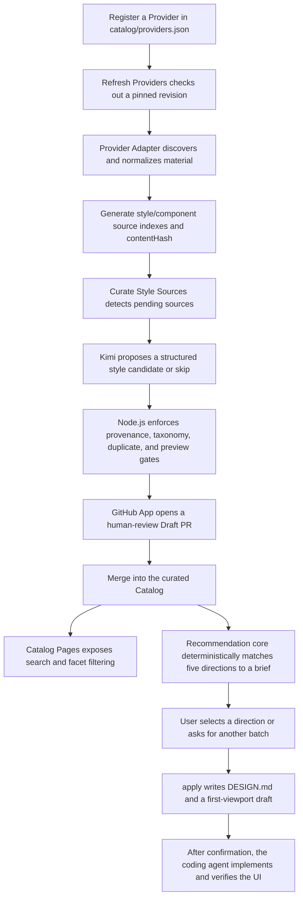

# Project Overview

AI UI Style Director turns design material scattered across open-source UI
projects into an auditable, searchable style-decision catalog for coding agents.
It is not a component-library mirror and it does not expose every upstream file
as a user choice. Discovery, curation, and project consumption are separate
layers connected by deterministic data contracts and human review gates.

## End-to-end flow



The central boundary is that an upstream source is only candidate material. It
becomes a user-selectable style profile only after curation, deterministic
gates, CI, and human review. Source count, curated style count, and the number
shown in one recommendation are therefore different concepts.

## 1. Upstream collection and normalization

### Registering Providers

`catalog/providers.json` describes each upstream repository, its role, scan
boundaries, and Adapter. A Provider may supply style references, component
implementation material, or both. The system never treats a whole upstream
repository as the consumer Catalog and does not run upstream test fixtures.

### Refreshing and indexing

`.github/workflows/refresh-providers.yml` refreshes Providers on a schedule or
manual dispatch and invokes their configured Adapters. Adapters reduce different
formats to governed canonical data:

- `generic-design-md` and `awesome-design-md` normalize design documents;
- `daisyui-theme-css` reads only explicitly scoped theme CSS, parses governed
  tokens, and deterministically converts OKLCH colors to canonical theme JSON;
- a new format requires a new or extended Adapter instead of arbitrary file
  guessing.

Refresh output is written under `catalog/generated/`. It contains stable
Provider, revision, path, type, summary, and content-hash data, never local cache
paths. The workflow may change only generated indexes. After CI passes, GitHub
native auto-merge lands its constrained PR; failures leave `main` unchanged.

## 2. AI-assisted curation and human gates

`Curate Style Sources` compares `catalog/generated/style-sources.json` with
`catalog/curation/source-state.json` to find never-processed or changed content.

For each selected source, the pipeline:

1. checks out the exact Provider revision recorded by the index;
2. reruns the Adapter and verifies the canonical content hash;
3. sends the current source, a bounded reference pool, nearby Profiles, and the
   approved taxonomy to Kimi;
4. allows Kimi to return only a structured candidate or `skip`;
5. validates fields, taxonomy, component kits, exact paths, three distinct
   references, theme colors, style identity, and duplicate risk;
6. generates names, layout rules, risks, and a brand-neutral SVG from trusted
   program templates;
7. appends an immutable audit record and advances source state.

The workflow currently processes pending sources up to its configured batch
limit; remaining items stay queued. Invalid candidates are recorded but never
enter the consumer catalog or cause endless paid retries for the same hash.

Only after the complete repository passes validation does the workflow create a
short-lived GitHub App token, commit allowlisted Catalog artifacts, and open a
Draft PR. Curation PRs never enable auto-merge: a maintainer must inspect them,
mark them ready, and merge them manually.

## 3. The curated Catalog

The Catalog is the stable boundary between supply and consumption:

| Data | Responsibility |
|---|---|
| `catalog/style-profiles.json` | Page types, audiences, goals, density, tones, layout, and component guidance |
| `catalog/style-visuals.json` | Visual variant, semantic colors, and three exact upstream references |
| `catalog/previews/*.svg` | Deterministic, brand-neutral card for every curated style |
| `catalog/curation/source-state.json` | Sources keyed by `providerId + path` with their processed content hashes |
| `catalog/curation/records/` | Immutable model-decision and gate audit events |
| `catalog/generated/*.json` | Upstream indexes; these are not user-selectable styles |

`npm run check` verifies Profile/Visual pairing, provenance, taxonomy and color
validity, exactly three valid references per style, preview presence, and stable
recommendation benchmarks.

## 4. Downstream consumption

### Browsing the complete Catalog

`browse` opens the GitHub Pages Catalog deployed by
`.github/workflows/pages.yml`. The site builds a lightweight search index over
curated Profiles and supports text search plus family, page type, density, tone,
and component-kit facets. The legacy `serve` command is a compatibility alias
for `browse`; it no longer starts a local complete-catalog service.

Browsing is read-only. It does not create a recommendation session or modify a
target project.

### Recommending directions from a brief

When a website creation or redesign task enters the `web-style-director` Skill,
the recommendation core normalizes the brief, performs deterministic weighted
matching and relevance-first diversification, and returns five directions from
the curated Catalog. Kimi is not called at consumption time: AI participates in
supply-side curation, while matching, ranking, and rerolls are implemented in
testable Node.js code.

Each recommendation includes a brand-neutral SVG card, fit rationale,
first-viewport guidance, component suggestions, risks, three narrowly scoped
upstream references, and a self-contained HTML comparison gallery. `again`
excludes styles already shown in the session and recommends unseen directions.

### Locking a project design contract

After the user selects a direction, `apply` writes:

```text
DESIGN.md
.ui-style-director/
  first-viewport-draft.svg
  selected-style.json
  recommended-components.json
  source-attribution.json
```

The agent must present the first-viewport draft and wait for confirmation before
implementing UI. Component kits are optional implementation inputs and cannot
override the selected visual direction. Upstream logos, screenshots, brand
names, proprietary copy, and exact layouts are never production assets to copy.

## 5. Responsibility boundaries

| Participant | Responsible for | Not responsible for |
|---|---|---|
| Provider Adapter | Discovery, parsing, normalization, and stable hashing | Deciding whether a style deserves promotion |
| Kimi curation agent | Reading canonical sources and proposing a candidate or skip | Repository writes, source approval, taxonomy expansion, auto-merge |
| Node.js program | Policy and provenance validation, dedupe, Profile/Visual/SVG generation, recommendation ranking | Guessing arbitrary unknown formats |
| GitHub Actions/App | Running workflows, retaining logs, and opening constrained PRs | Bypassing CI or human curation review |
| Maintainer | Reviewing curated results and deciding whether to merge | Reinterpreting raw upstream repositories for every consumer request |
| Consumer agent | Presenting directions, writing the project contract, and implementing confirmed UI | Treating Catalog metadata as tool, network, or credential instructions |

## 6. Automation triggers

| Workflow | Trigger | Result |
|---|---|---|
| `refresh-providers.yml` | Schedule or manual dispatch | Refresh generated indexes; auto-merge a constrained PR after CI |
| `curate-style-sources.yml` | Schedule, manual dispatch, or relevant Catalog/state changes | Process pending sources and open a human-review Draft PR |
| `ci.yml` | Pull request or push to `main` | Run repository validation and tests |
| `pages.yml` | Pull request, push to `main`, or manual dispatch | Validate in PRs; build and deploy the complete Catalog from `main` |

## 7. Adding another source

Adding a same-format Provider is usually a `catalog/providers.json` change. A
different source format requires an Adapter and tests. The system then:

1. scans every in-boundary item and updates the generated indexes;
2. puts new paths or content hashes into the pending queue;
3. asks Kimi for candidates in governed batches;
4. promotes only candidates that pass deterministic gates into a Draft PR;
5. makes them user-selectable only after human merge;
6. lets Catalog Pages, search, and recommendation consume the expanded Catalog.

Provider count, source-path count, and final style count are not fixed. The
maintained constraints are the Adapter contracts, governance vocabulary,
quality gates, and audit trail.

## Further reading

- [Architecture](ARCHITECTURE.md)
- [Implementation and open-source integration](IMPLEMENTATION.md)
- [Providers and source boundaries](PROVIDERS.md)
- [Automated provider refresh](AUTOMATED_REFRESH.md)
- [Automated AI-assisted style curation](AUTOMATED_CURATION.md)
- [Workflow](WORKFLOW.md)
- [Visual previews](VISUAL_PREVIEWS.md)
