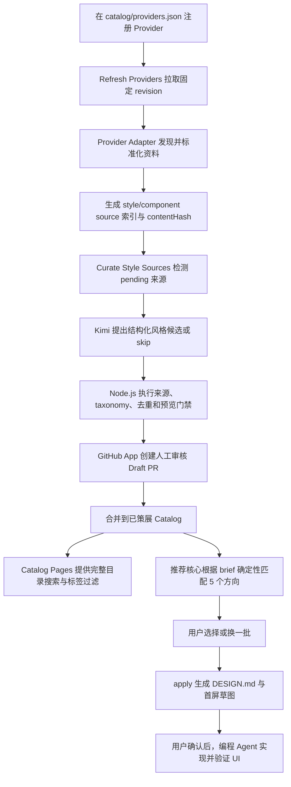

# 项目总览

AI UI Style Director 把分散在开源 UI 项目中的设计资料，转换为可审计、可搜索、
适合编程 Agent 消费的风格决策目录。它不是组件库镜像，也不会把所有上游文件直接
暴露给用户；系统把“发现资料”“策展风格”和“项目消费”分成三层，并在每层之间
保留确定性数据契约与人工门禁。

## 端到端流程



核心边界是：上游 source 只是候选资料，只有通过策展、程序门禁、CI 和人工审核的
条目，才会成为用户可选择的 style profile。因此，来源数量、已策展风格数量和一次
推荐展示数量是三个不同概念。

## 1. 上游资料收集与标准化

### 注册 Provider

`catalog/providers.json` 描述上游仓库、用途、扫描范围和 Adapter。Provider 可以提供：

- 风格资料，例如 `DESIGN.md` 或主题 token；
- 组件实现资料，例如 registry、组件源码或示例；
- 同时提供两类资料。

系统不会把整个上游仓库当成可消费 Catalog，也不会运行上游测试夹具。

### 刷新与生成索引

`.github/workflows/refresh-providers.yml` 定时或手动刷新 Provider，并调用配置的
Adapter。Adapter 负责把不同格式压缩成项目认可的规范数据：

- `generic-design-md` 与 `awesome-design-md` 规范化设计文档；
- `daisyui-theme-css` 只读取明确允许的主题 CSS，解析受治理 token，并把 OKLCH
  颜色确定性转换为规范主题 JSON；
- 新格式必须新增或扩展 Adapter，不能依赖任意文件猜测。

刷新结果写入 `catalog/generated/`。文件只保存稳定的 Provider、revision、路径、
类型、摘要和内容哈希，不包含机器本地缓存路径。刷新 Workflow 只允许修改生成索引，
通过 CI 后由 GitHub 原生 auto-merge 合并；异常时保持 PR 打开，`main` 不变。

## 2. AI 辅助策展与人工门禁

`Curate Style Sources` 比较 `catalog/generated/style-sources.json` 与
`catalog/curation/source-state.json`，找出从未处理或内容哈希发生变化的来源。

处理每条来源时：

1. 按索引记录的精确 revision 检出 Provider；
2. 再次运行 Adapter 并核对内容哈希，避免读取漂移的上游内容；
3. 把当前来源、有限参考池、相关 Profile 和允许的 taxonomy 发给 Kimi；
4. Kimi 只能返回结构化候选或 `skip`，不能直接修改仓库或批准风格；
5. 程序检查字段、taxonomy、组件库、精确来源、三条不重复参考、主题颜色、
   风格 ID 和重复风险；
6. 通过后由程序模板生成名称、布局规则、风险说明和中性 SVG 预览；
7. 每条决定写入不可变审计记录，并更新 source state。

当前 Workflow 按配置的批次上限处理 pending 来源；未处理的条目继续留在队列中。
模型返回非法候选时会记录为 `invalid`，不会进入用户目录，也不会对同一内容哈希
形成无限付费重试。

完整校验通过后，Workflow 才创建短期 GitHub App Token，提交白名单内的 Catalog
产物并创建 Draft PR。策展 PR 不启用 auto-merge，必须由维护者检查、标记为 Ready
并手动合并。

## 3. 已策展 Catalog

Catalog 是供给侧与消费侧之间的稳定边界：

| 数据 | 作用 |
|---|---|
| `catalog/style-profiles.json` | 页面类型、受众、目标、密度、调性、布局和组件建议 |
| `catalog/style-visuals.json` | 视觉 variant、语义颜色和三条精确上游参考 |
| `catalog/previews/*.svg` | 每个已策展风格的确定性、无品牌预览卡片 |
| `catalog/curation/source-state.json` | 按 `providerId + path` 记录来源及其已处理内容哈希 |
| `catalog/curation/records/` | 每次模型决定与程序门禁结果的不可变审计记录 |
| `catalog/generated/*.json` | 上游来源索引；它们不是用户可选风格 |

`npm run check` 会验证 Profile/Visual 一一对应、来源可追溯、taxonomy 与颜色合法、
每个风格恰好三条有效参考、预览存在，以及推荐基准仍然稳定。

## 4. 下游消费

### 浏览完整目录

`browse` 打开由 `.github/workflows/pages.yml` 部署的 GitHub Pages Catalog。页面从
已策展 Profile 构建轻量搜索索引，支持文本搜索以及 family、页面类型、信息密度、
视觉调性和组件库过滤。旧的 `serve` 是 `browse` 的兼容别名，不再启动完整目录的
本地服务。

浏览入口是只读的，不创建推荐 session，也不修改目标项目。

### 根据 brief 推荐方向

网站创建或重构任务进入 `web-style-director` Skill 后，推荐核心会标准化 brief，
根据结构化 Profile 做确定性加权评分和差异化，从已策展 Catalog 中返回 5 个相关
方向。消费端推荐不调用 Kimi；AI 参与发生在供给侧策展，而匹配、排序和换一批由
Node.js 程序完成，因此可以测试和复现。

每个推荐包含：

- 无品牌 SVG 风格卡片；
- 适配原因、首屏结构、组件建议和主要风险；
- 三条受限用途的真实上游参考；
- 可在浏览器中比较的自包含 HTML 画廊。

用户不满意时，`again` 会排除当前 session 已展示的风格，再推荐未展示方向。

### 锁定项目设计契约

用户选定方向后，`apply` 写入：

```text
DESIGN.md
.ui-style-director/
  first-viewport-draft.svg
  selected-style.json
  recommended-components.json
  source-attribution.json
```

Agent 必须先展示首屏草图并等待确认，之后才能依据 `DESIGN.md` 实现 UI。组件库只是
可选实现材料，不能反过来改变已经确认的视觉方向。上游 logo、截图、品牌名、专有
文案和精确布局不能作为生产资产复制。

## 5. AI、程序和人工分别负责什么

| 参与者 | 负责 | 不负责 |
|---|---|---|
| Provider Adapter | 发现、解析、标准化、计算稳定哈希 | 判断风格是否值得进入用户目录 |
| Kimi 策展 Agent | 阅读规范来源，提出结构化候选或跳过理由 | 写仓库、批准来源、扩展 taxonomy、自动合并 |
| Node.js 程序 | 校验来源与政策、去重、生成 Profile/Visual/SVG、推荐排序 | 对未知格式自由猜测 |
| GitHub Actions/App | 执行流程、留下日志、创建受限 PR | 绕过 CI 或人工策展审核 |
| 维护者 | 审查策展结果并决定是否合并 | 在消费端逐次重新解释原始上游仓库 |
| 消费端 Agent | 展示方向、生成项目契约、实现确认后的 UI | 把 Catalog 元数据当成工具或网络指令 |

## 6. 自动化触发关系

| Workflow | 触发 | 结果 |
|---|---|---|
| `refresh-providers.yml` | 定时或手动 | 更新生成来源索引；CI 通过后自动合并受限 PR |
| `curate-style-sources.yml` | 定时、手动或相关 Catalog/state 变更 | 处理 pending 来源并创建人工审核 Draft PR |
| `ci.yml` | `main` push 或 PR | 执行完整校验与测试 |
| `pages.yml` | `main` push、PR 或手动 | PR 中验证站点；`main` 上构建并部署完整 Catalog |

## 7. 接入新来源时会发生什么

新增一个格式相同的 Provider，通常只需要扩展 `catalog/providers.json`；新增不同格式
的来源，则必须实现 Adapter 与相应测试。之后系统会：

1. 扫描所有符合边界的资料并生成索引；
2. 把新路径或新内容哈希放入 pending；
3. 分批调用 Kimi 提出候选；
4. 通过确定性门禁的候选进入 Draft PR；
5. 人工合并后成为新的用户可选风格；
6. Catalog Pages、搜索索引和推荐核心自动消费扩展后的 Catalog。

因此，Provider 数量、来源路径数量和最终风格数量都不是写死的；真正需要维护的是
Adapter、治理词表、质量门禁和审计链路。

## 延伸阅读

- [架构](ARCHITECTURE.zh-CN.md)
- [实现详解与开源集成](IMPLEMENTATION.zh-CN.md)
- [Provider 与来源边界](PROVIDERS.zh-CN.md)
- [Provider 全自动刷新](AUTOMATED_REFRESH.zh-CN.md)
- [AI 辅助风格策展自动化](AUTOMATED_CURATION.zh-CN.md)
- [工作流程](WORKFLOW.zh-CN.md)
- [视觉预览](VISUAL_PREVIEWS.zh-CN.md)
