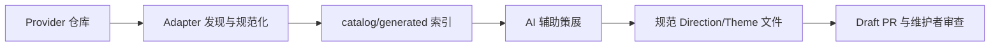

# Provider 与来源边界

Provider 配置位于 `catalog/providers.json`。Provider 只提供参考资料或实现组件，不会
直接变成用户可选条目；来源索引与 Catalog 策展是两个独立阶段。

## 当前 Provider

| Provider | 角色 | Style Adapter | 有效策展 capability |
| --- | --- | --- | --- |
| `awesome-design-md` | 风格参考语料 | `awesome-design-md` | Direction + Theme |
| `daisyui-themes` | Theme token 语料 | `daisyui-theme-css` | 仅 Theme |
| `design-md-flow` | 工作流参考 | 无 | 无 |
| `shadcn-ui` | 基础组件 | 无 | 无 |
| `origin-ui` | 应用和营销页面区块 | 无 | 无 |
| `magic-ui` | 动效丰富的营销组件 | 无 | 无 |
| `tremor` | Dashboard 和图表 | 无 | 无 |

当前生成快照包含 7 个 Provider、109 条 style source 和 600 条 component source。
它们是素材池数量，不是 Catalog 固定上限，也不等于 109 个用户可选风格。

## 从来源到 Catalog 的边界



运行索引刷新：

```bash
node bin/ai-ui-style-director.mjs refresh-catalog --clone
```

命令会刷新本地 Provider checkout，由各 Adapter 发现并规范化支持的 style source，
扫描组件 registry/文档，再把索引写入 `catalog/generated/`。它不会修改规范
Direction/Theme Catalog，也不会改旧版 profile/visual/alias 文件。

新增或变化的索引来源会进入独立策展队列。只有通过 Schema、capability、精确溯源、
两阶段去重、规范 Catalog、不可变 record 和仓库门禁，并由人工审查 Draft PR 后，
它才会进入用户可见 Catalog。

| 层 | 文件 | 所有者 |
| --- | --- | --- |
| 生成来源索引 | `catalog/generated/provider-inventory.json`、`style-sources.json`、组件索引 | refresh workflow |
| 规范消费 Catalog | `style-directions.json`、`style-themes.json`、`style-direction-themes.json`、`style-preview-specs.json` | 人工审查后的策展 |
| 兼容投影 | `style-profiles.json`、`style-visuals.json`、`style-aliases.json`、旧预览 | 自动策展只读 |

## Adapter 与 capability 契约

Style source 格式处理属于 Adapter。每个 Adapter 定义：

- 来源发现方式和 `sourceType`；
- 严格规范化方式和 `normalizerVersion`；
- `createDirection` / `createTheme` capability 上限；
- 格式推导出的可选约束，例如必须采用的 Theme。

Provider 可以显式收窄 Adapter 上限：

```json
{
  "id": "example-provider",
  "adapter": "generic-design-md",
  "capabilities": {
    "createDirection": true,
    "createTheme": true
  }
}
```

有效 capability 是 Provider 声明与 Adapter 上限的布尔交集。省略 `capabilities` 表示
接受 Adapter 上限；Provider 声明 `true` 也不能覆盖 Adapter 的 `false`。

程序把最终 capability、显式处理政策版本、Adapter ID 和 Normalizer 版本绑定为逐来源
`processingPolicyHash`。政策变化会让受影响来源进入 pending，而不依赖全局 Prompt
版本重放。

### `DESIGN.md` Adapter

`awesome-design-md` 保留既有 Awesome 语料语义和托管 overview/Light/Dark 参考链接。
未显式配置 Adapter 的非 Awesome Provider 默认使用 `generic-design-md`，递归发现文件名
为 `DESIGN.md` 的资料。两者的 Adapter 上限都允许创建 Direction 和 Theme；Provider
仍可进一步收窄。

模型输出继续受治理 taxonomy 和精确索引引用约束。真正的新来源格式应该新增一个经过
审查的 Adapter，而不是放宽通用解析器或把任意上游内容直接传给消费 Catalog。

### `daisyui-theme-css`

该 Adapter 刻意只匹配：

```text
packages/daisyui/src/themes/*.css
```

它提取受治理的 Theme token、确定性转换 OKLCH，并输出同时用于内容哈希和受限模型输入
的规范 JSON；仓库内其他 CSS 不会被当作 style source。

契约精确接受 29 个声明：1 个 `color-scheme`、20 个颜色 token 和 8 个几何 token。
未知、缺失、重复或格式非法的声明都会 fail closed。daisyUI `--color-primary` 映射为
Catalog 唯一的品牌/行动 `accent`；daisyUI `--color-accent` 继续保留在完整规范来源映射
中，作为辅助强调色。

该 Adapter 上限为仅 Theme，`daisyui-themes` 也显式声明了同样限制。因此，它只能在
可信程序选中符合资格的既有 Direction 后新增或关联 Theme，永远不能创建 Direction。
历史来源会保留 alias 还原出的 Direction；全新来源必须从受限候选上下文匹配既有
Direction，否则结果为 `invalid`。

若上游改变 Token Schema，必须通过普通人工审查代码 PR 更新白名单并提升
`normalizerVersion`。

## 新增 Provider

| 步骤 | 必需变更 | 审查问题 |
| --- | --- | --- |
| 1 | 在 `catalog/providers.json` 添加仓库元数据 | 角色和许可证是否明确？ |
| 2 | 选择已有 Adapter，或实现严格的新 Adapter | 输入格式是否规范、受限？ |
| 3 | Provider 需要更窄政策时声明 capability | 来源可以增加结构、Theme，还是两者都不能？ |
| 4 | 刷新生成索引 | 发现路径和哈希是否稳定？ |
| 5 | 运行 `npm run check` | 契约、溯源和迁移是否仍成立？ |
| 6 | 合并来源索引 PR | 策展 Workflow 随后按每批 5 条处理全部 pending 来源 |

Provider、source、Direction 和 Theme 数量都没有固定上限。5 只是单个策展批次最多处理的
来源数；`--drain` 会循环到所有 pending 来源均已处理。

## 溯源与 revision 语义

每条索引来源以精确 `providerId + path` 寻址，以规范内容哈希区分版本。Provider
inventory 固定一个 40 字符 Git revision。新规范 Theme 的 `source-pinned` 引用包含
Provider、路径、仓库、revision、内容哈希和来源 URL。

该溯源是历史证据。后续 refresh 可以推进 Provider inventory，但不能把既有 Theme 的
固定 revision 改写成当前上游 HEAD。若受治理来源内容或处理政策变化，稳定来源身份会
再次进入 pending，新不可变事件记录自己的快照。

旧版 Awesome slug 引用仍可展开为 getdesign.md overview 和 Light/Dark 链接；通用引用
使用精确 Provider 路径及固定到事件 revision 的 GitHub 页面。旧版
`style-visuals.json` 只是兼容投影，不是新增策展的写入目标。

State、去重、record、Action 白名单和 Draft PR 细节见
[AI 辅助风格策展自动化](AUTOMATED_CURATION.zh-CN.md)。

## 来源归因与品牌安全

Provider 仓库是灵感来源和实现材料，不代表可以克隆品牌。生成网站时应使用项目自有或
具备适当许可的资产，遵守开源许可证，并保留必要归因/声明。

不要复制上游 Logo、截图、受保护品牌名、专有文案或精确页面布局。集成代码前应检查
每个 Provider 的许可证；仓库声明见 `THIRD_PARTY_NOTICES.md`。
